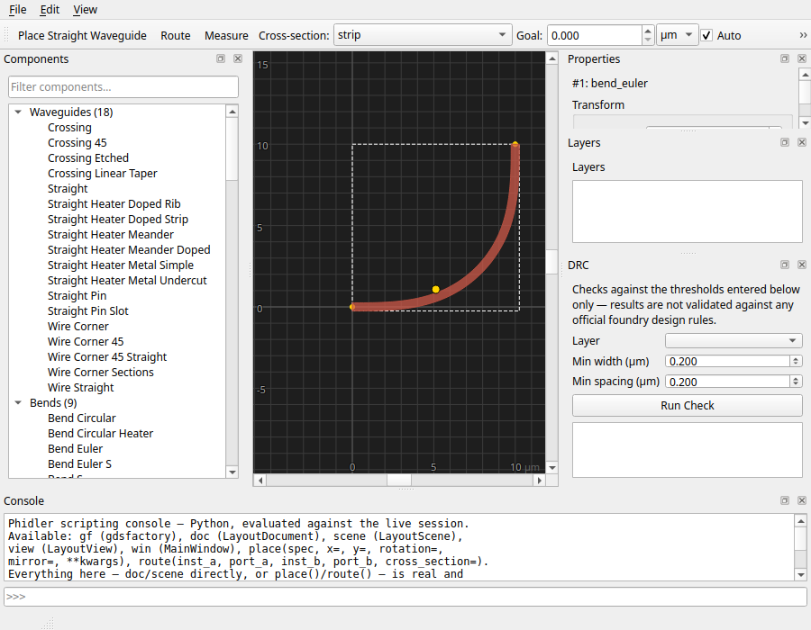
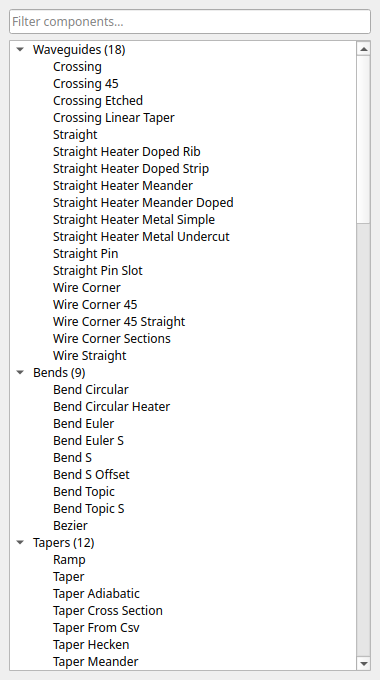
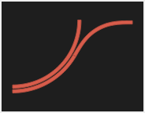
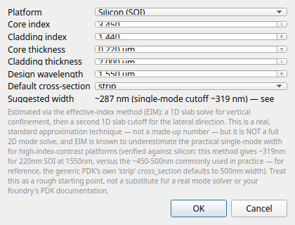
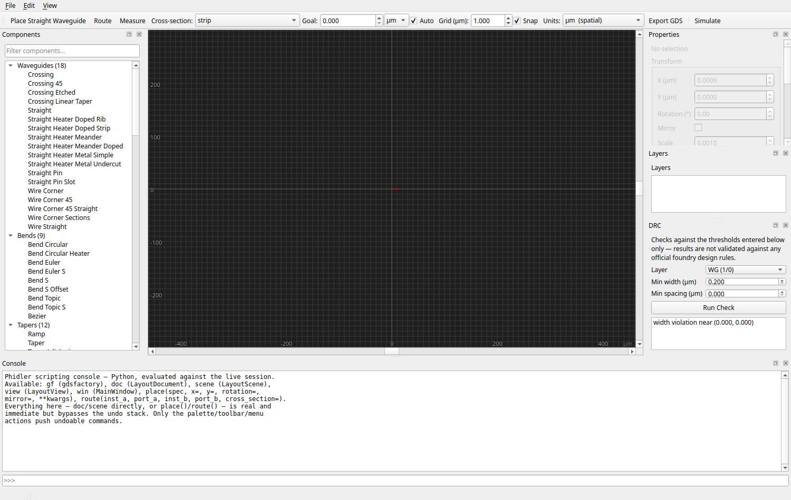
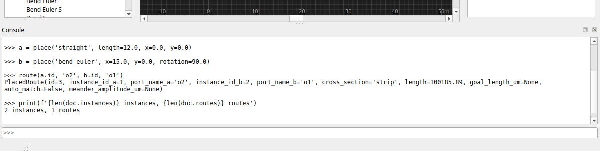

# Phidler

A graphical CAD application for photonic integrated circuit (PIC) layout,
built on [gdsfactory](https://gdsfactory.github.io/gdsfactory/) (phidl's
actively-maintained successor) with a PySide6 desktop UI, and exportable GDS.

A task-oriented user guide is also published at
**[noahpaladino.com/phidler](https://www.noahpaladino.com/phidler/)** —
shorter than this README and organized by task (placing components,
routing, saving, scripting console, etc.). It's built from
[`docs/`](docs/) with [MkDocs](https://www.mkdocs.org/); to build/serve it
yourself instead:

```
pip install -e ".[docs]"
mkdocs serve
```

then open <http://127.0.0.1:8000>. This README stays the single-page
reference with full implementation detail.

## Installation

Requires Python 3.10+.

```
git clone https://github.com/ngpaladi/phidler.git
cd phidler
python -m venv .venv
source .venv/bin/activate
pip install -e ".[dev]"
```

## Running it

```
./run.sh
```

This activates the project's venv and launches the app. On first run, if the
`.venv` doesn't exist yet, `run.sh` creates it and installs phidler (`.[dev]`)
automatically — so the manual venv steps under Installation are optional if you
just use `run.sh`. (FDTD support still needs the sibling photonfdtd installed
separately; see below.) (See "Environment gotcha" below for why a plain
`python -m phidler` from a different shell might crash on some Linux systems.)


The screenshots in this README are real renders — `QWidget.grab()` against
the actual running app under `QT_QPA_PLATFORM=offscreen`, not mockups. That
confirms every feature paints correctly; it does not confirm how any of it
*feels* to use (drag responsiveness, click precision, whether a layout
feels cramped) — see "Verification status" below for what that distinction
means in practice. The script that generates them,
[`docs/capture_screenshots.py`](docs/capture_screenshots.py), is checked in
so they can be regenerated after future UI changes.

## Features

- **Canvas**: pan (middle-mouse-drag — works reliably regardless of how
  little content is placed, see "Bugs found from actual use" below), zoom
  (scroll wheel), grid with snap-to-grid (pitch and snap toggle adjustable
  from the toolbar), zoom to fit / zoom to selection (View menu, `Ctrl+0` /
  `Ctrl+Shift+0`), live cursor coordinate readout in the status bar,
  right-click context menu. Single global Y-flip so GDS coordinates
  display correctly.
- **Port-to-port snapping**: when dragging an instance, if one of its
  ports ends up within 2µm of another instance's port, it snaps so they
  align exactly — instead of falling back to plain grid-rounding, which
  is what still happens when nothing's close enough. Dragging several
  selected instances together shifts the whole group by the same offset
  if any one of them finds a match, so their arrangement relative to each
  other doesn't shift. Proximity-only — it doesn't check whether the two
  ports actually face each other, a deliberate v1 simplification.
- **Editing**: click to select, drag to move (including multiple selected
  items at once), rotate (`R`) / mirror (`M`), multi-select via rubber-band
  drag or Select All (`Ctrl+A`), delete, copy (`Ctrl+C`) / paste (`Ctrl+V`).
  Full undo/redo (`Ctrl+Z` / `Ctrl+Shift+Z`) for every operation.
- **Align / Distribute** (Edit menu and right-click context menu, 2+
  instances selected): align left/right/top/bottom edges or horizontal/
  vertical centers, or distribute 3+ instances' centers evenly along an
  axis (the two extremes stay fixed; everything between them gets spaced
  evenly) — the standard set offered by vector/CAD editors. "Top"/"Bottom"
  follow the visual screen direction (confirmed empirically: the canvas's
  global Y-flip means a larger scene-y coordinate renders higher on
  screen), not `QRectF`'s own `top()`/`bottom()` naming, which is the
  opposite of the visual direction unless you read the code carefully —
  worth calling out since it would be an easy, silent mistake to align
  everything to the wrong edge. Each align/distribute action is a single
  undoable operation, even when it moves several instances at once.
- **On-canvas transform handles**: selecting a single instance shows the
  standard drag-handle interface — 4 corner handles for resizing and 1
  handle above the shape for rotating, the same convention used by
  PowerPoint/Keynote/Figma/Illustrator and basically every 2D editor.
  Dragging a corner scales the instance uniformly (klayout `DCplxTrans`'s
  `mag`, the same mechanism GDS itself uses for scaled structure
  references — it resizes the actual shape and its ports, not a component
  parameter like `length`) while keeping the **diagonally opposite
  corner fixed**, exactly like a standard resize handle; dragging the top
  handle rotates around the instance's placed position. Mirror and quick
  90° rotation stay on `R`/`M` and the right-click context menu (which
  also has Reset Transform) rather than living on the handles themselves,
  since mirroring isn't a drag gesture in any editor. Both gestures
  preview live and commit as a single undoable change on release, same
  pattern as dragging an instance on the canvas.

  
- **Component palette** (left dock): photonics-core categories (waveguides,
  bends, tapers, couplers, edge couplers, MMIs, rings, MZIs, grating
  couplers, filters, spirals, detectors) shown expanded at the top; the
  generic PDK's other domains (MEMS, quantum/superconducting electronics,
  microfluidics, analog RF, process-control-monitor test structures, dies,
  vias, pads, shapes, text, containers — ~300 components total across all
  categories) are tucked under one collapsed "Other" node instead of
  competing for attention. Names are prettified ("MMI 1x2" instead of
  "mmi1x2"; raw name always available as a tooltip) and filterable by
  either form. Hovering a component shows a floating preview of its actual
  rendered geometry (not an icon) near the cursor. Click (or Enter) arms
  placement, then click the canvas to place it.

   
- **Custom components**: File > Import Custom Components… loads a Python
  file, finds every function *defined* in it (not merely imported) that
  takes no required arguments and returns a `gf.Component`, registers each
  with the active PDK, and adds them to the palette under "Custom" —
  prettified names and all. A broken or unsupported function in the file
  is skipped with a status-bar note rather than failing the whole import.
  The imported file path is remembered and re-imported automatically when
  you reopen a project that uses one of its parts (custom cells only live
  in the PDK's registry for the process that imported them, so without
  this a saved layout using a custom part would fail to reload at all —
  caught in review, fixed the same way as the reference GDS path, with a
  regression test that simulates a fresh process via `pdk.remove_cell()`).
- **Project settings** (shown on startup and File > New, editable anytime
  via File > Project Settings…): pick a material platform (Silicon SOI,
  Silicon Nitride, Lithium Niobate, Lithium Tantalate, or Custom
  indices), core thickness, and design wavelength. LN/LT use real
  published thin-film-on-insulator refractive index values — the LN
  figure (2.211 at 1550nm) is cross-checked against two independent
  sources (the standard Zelmon/Small/Jundt 1997 Sellmeier fit for
  congruent LiNbO3, and the photonfdtd project's own LNOI mode-solver
  example); LT's (2.14) is a standard literature reference value with
  less independent cross-checking available. Both are simple core/clad
  index pairs like the silicon/nitride presets, not a full multi-layer
  stack-up (device layer + box + handle + cladding, each independently
  specified) — there's also no LN/LT-specific cross_section in the
  generic PDK, so these presets affect the suggested-width estimate and
  project metadata the same way the other platforms do, not the active
  PDK's actual layers. Sets the default routing cross-section and shows a
  suggested single-mode waveguide width — **read the disclaimer in the
  dialog before trusting that number**: it's a real effective-index-method
  approximation (verified against a known silicon platform during
  development), not a substitute for actual mode-solving, and it's known
  to run narrower than real-world practice for high-contrast platforms
  like silicon (it suggests ~290nm for 220nm SOI at 1550nm; the PDK's own
  "strip" cross-section — and most real designs — default to 500nm). The
  chosen platform/thickness/wavelength are recorded as project metadata
  in both the `.phidler` file and the exported Python script's header —
  they don't change the active PDK or any geometry on their own.

  
- **Properties panel** (right dock): editing a selected instance's
  parameters (length, width, radius, cross-section, etc.) regenerates its
  geometry live, undoable. `cross_section` is a dropdown of the active
  PDK's actual valid names, not freeform text, so a typo can't reach
  gdsfactory and fail. A **Transform** group above the parameter form
  shows X/Y/Rotation/Mirror/Scale as typed numeric fields — precision
  entry as an alternative to dragging by eye (e.g. matching an exact
  coordinate from a foundry PDK or an existing layout). Editing the
  fields and clicking **Apply Transform** pushes the same
  `MoveInstanceCommand` a canvas drag or handle gesture does, so it's
  undoable the same way; the fields themselves stay synced to the
  selected instance's live transform (via the same periodic timer that
  keeps the on-canvas handles positioned), except while you have focus in
  one of them, so typing a new value doesn't get overwritten mid-edit.
- **Layers panel** (right dock): visibility toggle + color picker per
  layer. Starts empty and only ever lists a layer the first time something
  you actually place/route/import uses it — not the active PDK's entire
  ~47-layer map regardless of relevance (see "Bugs found from actual use").
- **Routing**: toggle "Route" in the toolbar, pick a cross-section from the
  toolbar dropdown, click a port, click a second port — routes between them
  via `gdsfactory.routing.route_single`, rendered on the canvas and fully
  undoable/deletable (including the case where a route and one of its
  endpoint instances are deleted together in the same action). Routes are
  built from straight sections joined by euler bends (`route_single`'s own
  default `bend=`) — continuously-varying curvature, the standard
  low-loss "adiabatic" turn in photonics, as opposed to a constant-radius
  circular bend. Confirmed by inspecting the actual cell names inside a
  real generated route, not just trusting the default parameter's name,
  with a regression test that would catch any future change accidentally
  switching it to circular bends.
- **Measure tool**: toggle "Measure" in the toolbar, click two points (or
  two ports — a click within port-click range of a port snaps to its
  exact center, the same hit-radius logic routing mode's port clicks
  already use) to show the distance, dx, and dy between them as a
  temporary on-canvas annotation and in the status bar. A third click
  starts a fresh measurement, clearing the old one. Turning Measure on
  turns off Route mode and cancels any armed placement (and vice versa),
  so only one click-driven mode is ever active at a time.
- **GDS import as a reference backdrop**: File > Import Reference GDS loads
  an existing layout (e.g. a foundry floorplan) to design against. It's
  rendered dimmed and is *not* included in your own GDS export — it's a
  visual backdrop, not part of the design. The reference path round-trips
  through project save/load too.
- **DRC**: a width/spacing check against thresholds *you enter* in the DRC
  panel (right dock) — **not validated against any official foundry rule
  deck**, since the active generic PDK doesn't expose one. Violations are
  listed and double-click-to-zoom on the canvas.

  
- **Project save/load**: File > New/Open/Save/Save As round-trips a
  `.phidler` JSON file capturing the editable design (instances, routes,
  layer colors, reference backdrop path) — distinct from File > Export
  GDS, which is the flattened output artifact.
- **GDS export**: File > Export GDS (or the toolbar button).
- **Python script export**: File > Export Python Script… writes a
  standalone `.py` file that recreates the design via direct gdsfactory
  calls (`gf.get_component(...)`, `add_ref`, `route_single`) — for keeping
  the layout as reviewable, version-controllable code, alongside (not
  instead of) the `.phidler` recipe and the flattened GDS. Reuses the same
  instance/route data `save_project` does, just emitted as Python source.
  Running the exported script directly (`python my_design.py`) writes a
  `.gds` named after the script itself (`my_design.gds`) next to it —
  verified by actually invoking it as a subprocess, not just importing it
  as a module (`__name__` is only `"__main__"` when run that way, which
  matters since that's the gate on the GDS-writing code). A route whose
  endpoint instance no longer exists (no cascade-delete is a known
  limitation) becomes a comment in the script rather than a crash when the
  script is run.
- **Python script import**: File > Open now also accepts the `.py` files
  this app exports — it parses the script's actual AST (not by executing
  it and introspecting the result, which would lose the original
  component name + kwargs behind gdsfactory's mangled internal cell
  names; not via a separately-embedded data blob either, which could
  silently drift from hand-edits) to recover instances, transforms,
  routes, custom-component paths, and project settings directly from the
  real code. **This means editing a value directly in the script — e.g.
  changing `length=10.0` to `length=25.0` — and reopening it picks up the
  edit**, which is the actual point: the script is read as the source of
  truth, not a frozen snapshot. Additive to `.phidler`, not a replacement
  for it: layer color/visibility overrides and the reference GDS backdrop
  path have no representation in the generated script and reset to
  defaults on a `.py` open. Opening a `.py` also deliberately does not
  set the "current project path" — Save afterward goes through Save As
  instead of silently overwriting your script with JSON. The parser
  understands simple literal-value edits to Phidler's own generated
  shape; restructuring the code (loops, renamed-beyond-`inst_N`
  variables creating ambiguity, helper functions) raises a clear error
  rather than silently reconstructing something wrong — confirmed
  empirically that a naive recursive parse would otherwise silently
  collapse a `for` loop creating 3 instances down to 1.
- **Scripting console** (bottom dock, View menu to toggle): an interactive
  Python REPL running against the live session — `gf`, `doc`
  (`LayoutDocument`), `scene` (`LayoutScene`), `view` (`LayoutView`), `win`
  (this window), plus `place(spec, x=, y=, rotation=, mirror=, **kwargs)`
  and `route(inst_a, port_a, inst_b, port_b, cross_section=)` convenience
  helpers that both update the model *and* render immediately. Supports
  multi-line blocks (`for`/`if`/`def`, waits for a blank line like a normal
  REPL) and Up/Down history. Everything the console does — `doc`/`scene`
  calls directly, or through `place()`/`route()` — is real and immediate
  but **bypasses the undo stack**; only the actual UI actions (palette,
  toolbar, menus) push undoable commands. Power-user tool, not a
  GUI-equivalent shortcut.

  
- **FDTD simulation** (**Simulate > FDTD Simulation…**, a separate
  top-level window, not a dock — needs the optional `fdtd` extras, see
  below): `photonfdtd` (a Yee-grid time-domain engine — a private
  sibling project on this machine, not published on PyPI) wired in two
  ways:
  - **Vertical Mode Profile tab**: a fast (<1s) 2D cross-sectional scalar
    mode solve (`photonfdtd.ModeSolver`) showing the guided mode confined
    in the core, with a confinement-ratio check (edge/peak amplitude)
    that flags when cladding is too thin — confirmed empirically before
    building this: a deliberately-too-thin cladding visibly truncates
    the mode against the solver's zero-amplitude boundary (29% edge/peak
    ratio at 0.05µm vs ~0% once thick enough), which is the direct answer
    to "is my cladding thickness enough."
  - **Propagation (FDTD) tab**: a true 3D solve (the original v1 of this
    feature forced `z_size=0`, collapsing the vertical dimension for
    speed — replaced, since that made cladding thickness inert) against
    your placed layout via `from_gdsfactory`, using the active
    platform's core/clad index, core thickness, **and now cladding
    thickness** from Project Settings. Click **Place Source on Canvas**
    to click-place one or more sources directly on the main canvas
    (snaps to ports, same mechanism as the measure tool). Each source's
    color is entered as either **Wavelength (µm) or Energy (eV)** — the
    table syncs the two columns bidirectionally (`wavelength_um_from_
    photon_energy_ev`/`photon_energy_ev_from_wavelength_um` in
    `fdtd_sim.py`), so "a photon at 0.8 eV" doesn't need converting by
    hand. Three source kinds: a plain point dipole; a mode-injected
    `SinglePhotonSource` (built from the same mode solver, normalized to
    carry approximately one photon's energy — multi-photon counts scale
    amplitude by `sqrt(N)`, not by stacking N copies, confirmed via
    `FluxMonitor` to give N-fold energy scaling, not N²-fold); or
    **scripted** — a Python expression of `t` (seconds) typed directly
    into the table, evaluated as the source waveform (`ScriptedWaveform`
    in `fdtd_sim.py`) with the same full-Python trust model the
    scripting console elsewhere in this app already uses, not a new
    sandboxed mini-language. Results play back as a movie — a time
    slider and Play/Pause (looping) button scrub through field snapshots
    overlaid on an outline of your actual chip layout, the literal
    "money shot" this feature was built around.

  **Read the disclaimer in the window**: both tabs are illustrative —
  the dipole source isn't mode-matched to anything, the mode solver is
  scalar (no TE/TM distinction), and the "single photon" framing is
  semi-classical with an approximate absolute energy baseline (the
  *relative* N-photon scaling is exact, the *absolute* one-photon value
  isn't precisely h·f — both confirmed numerically, not assumed). Treat
  results as a qualitative look at how light spreads through your
  structure, not a calibrated transmission measurement, the same honesty
  framing as the EIM width estimate and the DRC panel elsewhere in this
  app. True 3D propagation runs on a background thread (calibrated
  empirically at ~6×10⁻⁸s/cell-step on dev hardware — a real-sized
  layout lands in the tens-of-seconds-to-minutes range), with a
  confirmation prompt showing the *estimated time* (not just a cell
  count) before starting a run that would otherwise look like a frozen
  app. Not on PyPI: install from its own checkout first
  (`pip install -e /path/to/FastTiming/photonfdtd`), then
  `pip install -e ".[fdtd]"` here. If it's missing when you click **Simulate**,
  the app offers to download and install it from GitHub on the spot (with your
  approval) rather than crashing or dead-ending — so a manual install is
  optional.

## Bugs found from actual use

Everything above this point in development had only ever been checked
headlessly. Once actually run on a real display, two real bugs surfaced
immediately that no amount of headless testing could have caught:

- **Panning didn't work at all.** `QGraphicsView` auto-computes its
  scrollable range from the placed content's own tight bounding box. A
  single small waveguide easily fits inside any normal window, so that
  range collapsed to exactly `(0, 0)` — there was nowhere to scroll to,
  even though the middle-drag press/move/release handling itself was
  correct. Fixed by giving the canvas a fixed 100mm×100mm virtual working
  area, independent of however much or little is actually placed.
- **The Layers panel was overwhelming** — pre-populated with the active
  PDK's entire ~47-layer map (every doping layer, via, metal layer, label
  layer, etc.) regardless of whether the current design touched any of
  them. Fixed by having the document start with an empty layer set and
  only add an entry the first time something placed/routed/imported
  actually uses that layer.

Both are now fixed and covered by regression tests (including one driven
through real simulated `QTest` mouse press/move/release sequences for the
panning fix) — but they're a concrete reminder that the "implemented but
unverified" framing below was not hypothetical caution.

## Verification status

This was built and iterated on primarily in a **headless environment**
(`QT_QPA_PLATFORM=offscreen`). 284 automated tests cover what's checkable
that way; run them with:

```
./run_tests.sh
```

That verification splits cleanly into two tiers, and it's worth being
explicit about which is which rather than letting a passing test count
imply more than it proves:

**Fully verified, headless, with confidence** — geometry, transforms, and
data integrity, which don't depend on how anything looks:
- Every placed/edited/routed/exported shape's coordinates checked
  numerically against `klayout.db.DCplxTrans` directly, including
  rotation, mirroring, and polygon holes (a real bug here — holes were
  silently dropped from rendering — was caught and fixed).
- The entire 310-component catalog is exhaustively placed and exported in
  `tests/test_scale.py` (not just a hand-picked sample) — this caught two
  real bugs: 25 catalog entries that weren't actually registered in the
  PDK (would have failed on placement) and 4 `ComponentAllAngle` factories
  needing a different placement API than the rest of the catalog.
- Four separate "a mutating operation can raise partway through and leave
  corrupted state" bugs were found and fixed transactionally, each with a
  regression test: (1) an invalid property edit used to delete an
  instance's geometry before validating the replacement, leaving it
  visible but silently dropped from GDS export; (2) `QUndoStack.push()`
  inserts a command even when its `redo()` raises, which could poison the
  undo stack on a failed route or a failed placement; (3) deleting an
  instance and its route together relied on `QUndoStack` undoing a macro's
  children in reverse push order — the original push order made undo fail
  with a `KeyError` partway through, leaving only half the deletion undone;
  (4) the same `redo()`-raises hazard applied to placing a component at
  all, which matters much more now that custom (unvetted, user-supplied)
  components can fail in ways the exhaustively-tested built-in catalog
  never does.
- Save/load round-trips by replaying the document's own recipe
  (component spec + kwargs + transform, port pairs for routes) rather than
  serializing gdsfactory objects, and tolerates a missing/moved reference
  GDS file or custom-component file without failing the rest of the load.
  Re-imports any custom-component files a project used *before* replaying
  instances, since those only exist in the active PDK's registry for the
  process that imported them — verified by simulating a fresh session
  with `pdk.remove_cell()` rather than just reusing the same in-process
  registration the save came from.
- Multi-item drag (dragging one of several selected items moves all of
  them) and middle-drag panning — both confirmed via real simulated
  `QTest` mouse press/move/release sequences, not just unit-level model
  calls (the panning test specifically guards against the no-scrollable-
  range regression described above).
- Pure transform/math helpers (`view.snap()`, cursor-position
  `mapToScene`, zoom-to-fit/selection's scale and containment) checked
  directly rather than via injected mouse events.
- Custom component loading distinguishes functions actually *defined* in a
  user's file from ones merely imported into it (e.g. `from
  gdsfactory.components import straight`) via `__module__`, verified
  empirically that `@gf.cell` preserves that correctly rather than
  assumed; a function that raises or returns the wrong type is skipped,
  not allowed to crash the whole import.

**Implemented, but genuinely needs your eyes** — these features' entire
point is how they look or feel, which cannot be assessed without a real
display:
- Right-click context menu, status bar cursor readout, grid pitch/snap
  controls, zoom to fit/selection, component hover preview. The underlying
  logic for each is tested (e.g. "does the menu contain the right
  actions," "does the reported coordinate match the transform," "is the
  rendered preview pixmap non-blank and cached correctly") but **nothing
  tests that the menu visually appears under the cursor, that the
  coordinate label is legible, that zooming feels smooth, or that the
  hover preview's popup position/size/legibility is actually good** —
  those need a human.
- One honest caveat from getting here: I tried to test the context menu by
  injecting a synthetic `QContextMenuEvent` through Qt's real event
  system (`QApplication.sendEvent`) — it **segfaulted the interpreter**
  under this offscreen platform. That code path doesn't exist in the
  actual app (production goes through a real platform event, never
  `sendEvent`), so it isn't a correctness concern, but it's why these
  tests call the event-handler overrides directly as plain methods instead
  of injecting native events — a deliberate, narrower verification style
  than the mouse-drag tests elsewhere in this suite.
- Drag responsiveness, pan/zoom comfort, color legibility, whether the
  routing click-to-pick-a-port interaction feels natural — none of this
  changed since the original headless build, and none of it can be judged
  without running it.
- The on-canvas transform handles and the Project Settings dialog are both
  new and both fall in this bucket too. Every piece of their *logic* is
  tested directly — including, for the handles, the specific property
  that actually matters (a corner drag keeps the diagonally opposite
  corner exactly fixed, confirmed via a real simulated `QTest` mouse
  drag through the actual view, not just a direct method call) — but
  `QDialog.exec()` is a blocking modal call, same as every other dialog
  in this app, so nobody has actually seen the Project Settings dialog
  rendered, and whether the handles feel natural to grab/drag at actual
  mouse speed hasn't been judged by a human either.

Please launch `./run.sh` and try:

1. Place a few different components from the palette (try a ring, an MMI,
   a grating coupler — not just a straight waveguide), drag one or several
   selected at once, rotate/mirror, undo/redo.
2. Edit a selected instance's parameters (including the cross_section
   dropdown) in the Properties panel and watch it regenerate.
3. Toggle "Route", pick a cross-section, click a port on one component then
   a port on another, confirm a route appears and is selectable/deletable.
4. Right-click the canvas — confirm the context menu appears under the
   cursor and its actions work.
5. Watch the status bar while moving the mouse over the canvas; adjust the
   grid pitch/snap controls in the toolbar.
6. Zoom to fit / zoom to selection from the View menu.
7. Toggle a layer's visibility and change its color in the Layers panel.
8. Import a GDS as a reference, confirm it renders dimmed and stays out of
   your own export; save the project, reopen it, confirm the reference
   comes back too.
9. Run a DRC check, double-click a violation to confirm the view jumps
   there.
10. Import a custom component (File > Import Custom Components… on a
    Python file with a `@gf.cell`-decorated function) and confirm it shows
    up under "Custom" in the palette, prettified name and all.
11. Export GDS and open it in KLayout (or anything else you trust) to
    confirm it looks right.

If anything feels off (drag lag, grid too dense/sparse, colors hard to
read, zoom too sensitive, routing clicks feeling imprecise, the context
menu appearing in the wrong place), tell me and I'll tune it.

## Environment gotcha

On Linux, if your system already has its own Qt6 install, the dynamic
linker can resolve it *before* the newer Qt6 bundled inside the PySide6
wheel, causing an `undefined symbol` crash on import. `run.sh` and
`run_tests.sh` work around this by prepending PySide6's own Qt lib
directory to `LD_LIBRARY_PATH` before launching, so the linker finds the
matching version first. If you ever run the app a different way (not via
those scripts) and hit this crash, set the same variable yourself:

```
export LD_LIBRARY_PATH="$(find .venv/lib -maxdepth 1 -name 'python3.*')/site-packages/PySide6/Qt/lib:$LD_LIBRARY_PATH"
```

## Architecture

```
src/phidler/
  app.py                  # QApplication bootstrap + PDK activation
  main_window.py          # menus/toolbar/docks, action wiring
  pdk_catalog.py           # introspects gf.components into a placeable, categorized, PDK-validated catalog; name/category prettification
  custom_components.py     # loads user Python files, registers valid factories with the active PDK
  drc.py                   # width/spacing checks against user-supplied thresholds
  project_io.py            # save/load: replays the document's own recipe, not raw objects
  export_script.py          # writes a standalone .py that recreates the design via direct gdsfactory calls
  import_script.py          # AST-parses a Phidler-generated .py back into document/scene state
  waveguide_calc.py          # effective-index-method single-mode width estimate + platform presets
  fdtd_sim.py                # pure-compute FDTD wiring (photonfdtd) — no Qt/threading, fully unit-testable
  model/
    document.py            # LayoutDocument — owns the gdsfactory top cell; ProjectSettings metadata
    placed_instance.py     # PlacedInstance / PlacedRoute records
    layers.py               # layer list, populated on demand as layers are actually used (not pre-seeded)
    commands.py             # QUndoCommand subclasses (Add/Delete/Move/EditParams/Route)
  canvas/
    scene.py                # QGraphicsScene wrapper around LayoutDocument; fixed large sceneRect for panning
    view.py                 # pan/zoom/grid/snap/zoom-to-fit, Y-flip, drag->undo wiring, placement/routing/context-menu
    polygon_item.py         # per-instance QGraphicsItem rendering (hull+holes, ports)
    transform_handles.py      # on-canvas drag handles for rotate/scale (the standard 2D-editor convention)
  panels/
    component_palette.py    # curated category tree (core photonics first, niche under "Other"), click-to-place, hover preview wiring
    component_preview.py     # renders a component's actual geometry to a small pixmap; floating popup widget
    properties_panel.py     # dynamic parameter form from factory signatures
    layers_panel.py          # layer visibility/color dock widget
    drc_panel.py             # DRC threshold inputs + violation list
    console_panel.py          # interactive Python REPL (code.InteractiveInterpreter) against the live session
    project_settings_dialog.py # material/thickness/wavelength picker shown on startup and File > New
    fdtd_window.py            # FDTD top-level window: mode-solve tab, propagation tab, source table, movie playback; FdtdWorker/ModeWorker (QThread wrappers around fdtd_sim.py)
tests/                       # all run under QT_QPA_PLATFORM=offscreen
```

Key design notes:
- Scale's transform math (`mag` composing with rotation/mirror) was
  verified against `klayout.db.DCplxTrans` directly before being wired up,
  same discipline as the original rotate/mirror math: mirror and uniform
  scale commute (so `QTransform.scale(mag, -mag if mirror else mag)` in
  one call reproduces klayout's mirror-then-scale exactly), but rotation
  must still be the outermost (last-applied) operation.
- The transform handles reposition via a 120ms polling timer rather than
  hooking into every view-mutating interaction (pan/zoom/resize/drag)
  individually — simpler and harder to leave a gap in than enumerating
  every path that could move the selected item on screen. It skips
  re-syncing handle positions while any handle reports `is_dragging`, or
  the periodic sync would fight the drag.
- The handles are real `QGraphicsItem`s added directly to the scene (not
  a `QWidget` floating over the viewport, which the first version of this
  feature used) — confirmed empirically that `ItemIgnoresTransformations`
  keeps a handle's on-screen pixel size constant across zoom levels, the
  standard look for resize handles, and that being plain scene items
  means they pan/zoom with the view for free, no manual position-mapping
  needed the way the QWidget version required.
- A corner-drag scale gesture keeps the **diagonally opposite corner**
  fixed in absolute scene coordinates, the standard 2D-editor resize
  behavior — solved once at drag-start for the `mag` and `(x, y)` that
  satisfy both "opposite corner unchanged" and "dragged corner tracks the
  cursor," not re-derived per mouse-move frame. This was a deliberate
  fix during development: anchoring the scale at the instance's local
  origin instead (where `mag` actually mathematically pivots, per
  klayout's `DCplxTrans`) does NOT have this property — for `straight`,
  whose local origin sits almost on the bounding box edge, that would
  make one corner barely move and the opposite corner swing wildly for a
  small mouse movement. The rotate handle, by contrast, pivots around the
  instance's local origin directly (same pivot the `R` key already uses),
  which needs no such compensation.
- The rotate handle computes rotation as a **delta angle** (how far the
  mouse has swept around the pivot since the press, added to the
  rotation at press-time), not an absolute target angle — verified
  empirically that the scene-frame `atan2` angle and the `rotation`
  parameter consumed by `DCplxTrans`/`QTransform.rotate()` move in the
  same direction by the same amount, so the delta is correct without any
  sign correction for the canvas's global Y-flip.
- `LayoutScene` sets a fixed, large `sceneRect` (100mm × 100mm) rather than
  letting `QGraphicsView` auto-size it from placed content — see "Bugs
  found from actual use" above for why that auto-sizing breaks panning
  entirely once content fits inside the viewport.
- Geometry is pulled from gdsfactory once per place/edit/import — never
  during a drag — so dragging only touches Qt item transforms and stays
  responsive regardless of layout size.
- The canvas renders polygon holes correctly (odd-even fill `QPainterPath`,
  not a hole-dropping `QGraphicsPolygonItem`) so what you see always
  matches what gets exported. Verified against a deliberately-holed
  in-memory component, not just assumed.
- The Qt-side rotate/mirror/translate math was verified numerically against
  `klayout.db.DCplxTrans` directly (`tests/test_gds_roundtrip.py`,
  `tests/test_holes.py`) rather than assumed — gdsfactory 9.x's API (PDK
  activation requirement, `route_single` replacing `get_route`, polygon
  extraction needing a dbu conversion) postdates a lot of training data, so
  every non-trivial API call here was checked against the actually-installed
  version first. The same discipline applied to Qt itself: `fitInView`'s
  interaction with the global Y-flip and `QComboBox.findData()`'s
  unreliable matching on Python tuples were both verified empirically
  rather than assumed, in either direction (confirming one fear was
  unfounded, the other very real).
- The component catalog only includes names actually registered in the
  active PDK's cell registry and excludes `ComponentAllAngle` factories
  (which need `add_ref_off_grid()`, a different placement primitive this
  app doesn't support) — both exclusions were added after an exhaustive
  placement test caught them, not designed in upfront.
- Routes are rendered via `gdsfactory.functions.get_polygons(ref)`, which
  returns already-absolute (top-cell) coordinates for an arbitrary ref —
  so route geometry needs no additional Qt-side transform, unlike instances.
- A GDS reference backdrop is kept as a standalone `gf.Component`, never
  added into the document's top cell, so it can't leak into your own
  GDS export.
- `QUndoStack.push()` still inserts a command even if its `redo()` raises,
  and undoes a macro's children in reverse push order — both confirmed
  empirically, not assumed. `AddRouteCommand`/`EditParamsCommand` guard the
  first with an internal `.error` flag; the instance/route delete macro is
  ordered specifically to satisfy the second (routes pushed before
  instances, so undo restores instances before routes need them back).
- Synthetic native event injection (`QApplication.sendEvent` with a
  constructed `QContextMenuEvent`) segfaulted the interpreter under the
  offscreen platform during test-writing. Tests for event-handler overrides
  call them directly as plain methods instead — this isn't a production
  code path concern (real events never go through `sendEvent`), but it's
  why some tests in this suite look structurally different from the
  `QTest`-based mouse-drag tests elsewhere. The hover-preview tests follow
  the same approach: they emit `itemEntered` directly (a plain Qt signal,
  not a native event) rather than injecting a synthetic mouse-move.
- The full test suite has a low (~1-in-9 in one measured batch), pre-
  existing native-crash flake under the offscreen platform — present
  before any of the FDTD/matplotlib work, confirmed directly: it still
  reproduces with `--ignore`-ing every new FDTD test file, so the
  `PySide6.QtSvg` module visible in the crash's loaded-extension-modules
  dump is incidental (loaded by something already in the dependency
  tree), not evidence the FDTD integration caused it. Root cause not
  pinned down; treated the same as the `sendEvent` segfault above — a
  known, narrow, environment-specific instability documented here rather
  than silently retried until green. If a run fails, rerun it.
- The hover preview always colors layers with the same deterministic
  default scheme as a brand-new layer would get, not whatever you've
  customized in the open document's Layers panel — and its by-name pixmap
  cache would show stale geometry if you import a second custom file that
  redefines a name from the first. Both are cosmetic, preview-only
  limitations, not correctness issues for the actual design/export.
- The scripting console uses `code.InteractiveInterpreter` for proper
  multi-line handling rather than reimplementing it — but each call needs
  the *full accumulated* buffer, not just the latest line (confirmed
  empirically: passing one line at a time inside a `for` block raised
  `IndentationError`, since the interpreter has no memory of its own
  between calls). Separately, `quit()`/`exit()` raise `SystemExit`, which
  propagates straight through `runsource()` uncaught — confirmed this
  would silently kill the whole desktop app, not just the console, hence
  the explicit `except SystemExit` around every call.
- Console mutations render on the canvas immediately but don't refresh the
  Layers/DRC panels — those only refresh on `undo_stack.indexChanged`,
  which console activity never touches (by design: it bypasses the undo
  stack entirely). `place('straight')` from the console won't make WG show
  up in the Layers panel until some other action touches the undo stack.
  Cosmetic, not a correctness issue, and consistent with the console being
  a deliberate bypass rather than a GUI-equivalent path.
- The Project Settings dialog shows automatically on app startup via
  `QTimer.singleShot(0, window._new_project)` called from `app.main()` —
  deliberately *not* from `MainWindow.__init__` itself. `_new_project()`
  opens a blocking modal dialog; triggering that during construction would
  hang every single test that builds a `MainWindow()` (there's no event
  loop running yet for a synthetic dismissal). The singleShot fires after
  the event loop starts and the window is already shown, which is also
  just better UX (you see the app, then the dialog) than the reverse.
  `_new_project()` itself is split into the dialog-showing wrapper and a
  testable `_reset_to_new_project(settings)` core, the same pattern used
  for every other dialog-gated action in this app (context menu, custom
  component import).
- The suggested single-mode waveguide width uses a real two-step
  effective-index method (slab solve for vertical confinement via
  bisection, then a second slab cutoff for the lateral direction) — not a
  made-up number, but verified during development to run meaningfully
  narrower than real-world practice for silicon specifically (high index
  contrast is a known weak point of EIM): ~319nm cutoff for 220nm SOI at
  1550nm, against the ~450-500nm commonly used and the generic PDK's own
  500nm "strip" default. The dialog's disclaimer says this explicitly
  rather than letting the number imply more precision than it has.
- The Lithium Niobate preset's `core_index` (2.211 at 1550nm) was
  cross-checked against two independent sources rather than taken from
  one: the standard Zelmon, Small & Jundt (1997) Sellmeier fit for
  congruent LiNbO3, and a second data point — the photonfdtd project's
  own LNOI mode-solver example uses n=2.30 at 600nm, which the same
  Sellmeier equation reproduces to 3 significant figures (2.296),
  confirming the coefficients are correct rather than mis-remembered. The
  Lithium Tantalate preset's index (2.14) is a standard literature
  reference value but didn't have a second source available to
  cross-check against during development — noted as such in the code
  rather than presented with the same confidence as the LN figure.
- `import_script.py` only inspects a script's *direct top-level
  statements* (`tree.body`), never a recursive `ast.walk()`. Confirmed
  empirically why this matters: a hand-written `for i in range(3): inst =
  top.add_ref(...)` matches the exact same static assignment shape as one
  real Phidler-generated instance — a recursive walk would silently
  reconstruct 1 instance from code that creates 3 at runtime, since
  static analysis can't know how many times a loop body actually
  executes. Restricting to top-level statements turns that into "this
  loop isn't a recognized top-level shape" → a clear `ScriptParseError`,
  not a silent wrong answer. The same restriction is why a renamed
  `inst_N` variable still loads (it's still a flat, top-level statement,
  just without a recoverable original id) while a loop, conditional, or
  helper function around the same code does not.
- Port-to-port snapping reuses `kdb.DCplxTrans` (the same transform
  primitive used for instance geometry) to compute absolute port
  positions, rather than re-deriving the mag/rotation/mirror composition
  for ports separately — verified directly against a known transform
  (a 90°-rotated, translated waveguide's ports land exactly where the
  rotation+translation predicts). While dragging, it has to compute a
  dragged instance's port positions against its *live, uncommitted* Qt
  item position, not the document's (still-stale) stored transform — see
  `LayoutDocument.get_absolute_ports_for_transform`, which takes an
  explicit override transform for exactly this.
- The Properties panel's precision-entry transform fields use the exact
  same is-interacting-style guard the on-canvas handles use for their own
  periodic resync (`PropertiesPanel._is_editing_transform`, checked via
  `QWidget.hasFocus()`) — but `hasFocus()` never becomes true under
  `QT_QPA_PLATFORM=offscreen`, confirmed empirically across several
  `setFocus()`/`activateWindow()` combinations, since there's no real
  window manager to grant input focus headlessly. The regression test for
  this guard's logic monkeypatches the guard method directly rather than
  trying to exercise real Qt focus, which this environment can't produce.
- The measure tool's label uses `QGraphicsItem.ItemIgnoresTransformations`
  for constant on-screen text size across zoom — the same flag the
  on-canvas transform handles use, and a real, easy-to-hit mistake during
  development: setting the flag via `label.ItemIgnoresTransformations`
  (an instance attribute lookup on a `QGraphicsSimpleTextItem`) raises
  `AttributeError`, since the flag is only defined on the `QGraphicsItem`
  base class, not inherited into the instance namespace that way — caught
  immediately by actually running a simulated click through the real
  widget rather than only unit-testing the math in isolation.
- Port-snapping for a measurement click reuses `InstanceItem.nearest_port`
  unchanged — the same hit-radius logic and constant routing mode's port
  clicks already use — rather than introducing a second, possibly
  inconsistent distance threshold for "close enough to snap."
- Align/Distribute's "top"/"bottom" had a real, easy-to-get-backwards
  trap: a plain `QRectF`'s `top()`/`bottom()`/`left()`/`right()` only
  return whatever min/max order the rect happened to be *constructed*
  with — confirmed empirically with `QRectF().setCoords(0, 5, 10, 0)`,
  where `top()` returned 5.0 and `bottom()` returned 0.0, the opposite of
  the conventional smaller/larger-y meaning. `QGraphicsItem.mapRectToScene`
  happened to already return a normalized rect in the cases tested, but
  `_selected_scene_bboxes` calls `.normalized()` explicitly anyway rather
  than depending on that being guaranteed. Separately, even a correctly
  *normalized* rect's `top()` (the smaller scene-y) is the **visual
  bottom** on screen, not the visual top — confirmed empirically that the
  canvas's global Y-flip makes a larger scene-y coordinate render higher
  up — so "Align Top" deliberately reads `box.bottom()` internally, with
  a regression test (`test_align_top_uses_the_visual_screen_direction_
  not_qrectf_naming`) that exists specifically to catch a future edit
  that gets this backwards.
- Align/Distribute computes each instance's move as a single scalar
  shift along one axis (`target − current_edge_or_center`, added to the
  stored `x` or `y`), rather than decomposing each instance's rotation/
  mirror/scale to reposition it — this works uniformly regardless of an
  instance's own rotation or scale, since `mapRectToScene` already gives
  the correct axis-aligned bounding box for *any* transform, and only the
  position needs to change for a pure align/distribute (rotation, mirror,
  and scale are deliberately left untouched).
- The FDTD integration is split into a pure-compute core (`fdtd_sim.py`,
  no Qt or threading at all) and a thin Qt layer on top (`fdtd_window.py`'s
  `FdtdWorker`/`ModeWorker`, `QThread` wrappers) — built and tested in
  that order, on advice given before writing any of it: entangling
  compute with threading is what makes a feature like this hard to test,
  so they're kept apart deliberately, not as an afterthought refactor.
- The original v1 of this feature forced `z_size=0.0` on
  `from_gdsfactory`'s 3D `Simulation`, collapsing the vertical dimension
  to one cell for speed — this was **replaced**, not kept: a user asked
  "shouldn't I be able to set cladding thickness?", and investigation
  showed the quasi-2D collapse made that setting inert regardless of its
  value, since the single z-slice resolved core/cladding contrast purely
  by XY polygon footprint, not vertical position. True 3D is genuinely
  more expensive (calibrated empirically: 141k cells/394 steps → 2.5s,
  525k cells/1312 steps → 40.8s, ~6×10⁻⁸s/cell-step), but is what makes
  cladding thickness — and the "money shot" top-down field movie — mean
  what they claim to mean.
- Removing the z-collapse surfaced a real, separate bug, caught by
  directly inspecting `sim.eps_r` rather than trusting the adapter's
  docs: background slabs only covering *above* and *below* the core's
  own z-range left that z-range itself unstamped outside the waveguide
  polygon, silently defaulting to vacuum (`eps_r=1`) instead of lateral
  cladding. Fixed by adding a third background slab spanning the same
  z-range as the core layer, stamped first so the polygon still wins
  inside the waveguide footprint (per `from_gdsfactory`'s own documented
  stamping order).
- `photonfdtd.ModeSolver` (a 2D scalar-Helmholtz cross-section eigenmode
  solver, already in the package, previously unused) is the tool that
  makes "cladding thickness" answerable: at a deliberately-too-thin
  0.05µm cladding the mode is visibly truncated against the solver's
  zero-amplitude domain boundary (wrong n_eff 2.14 vs converged 2.60,
  29% edge/peak amplitude ratio); at ≥1.0µm it converges cleanly (~0%).
  `mode_confinement()` turns this into a direct "well confined" /
  "cladding may be too thin" status message instead of leaving the user
  to interpret a raw ratio. The solver's own eigensolve cost is
  superlinear in grid size (6.5s at 414k points, didn't converge in 30s
  at 1.65M during calibration) — the UI defaults (`cell_size_um=0.02`,
  modest lateral padding) were chosen to stay well under a second, not
  guessed.
- `photonfdtd.sources.SinglePhotonSource` (also already in the package)
  is the literal mechanism behind "inject a photon at a given energy" —
  a `ModeSource` built from a solved mode profile, amplitude-normalized
  to carry approximately `h·freq0` of energy; its own docstring flags
  this normalization as approximate and suggests verifying with a
  `FluxMonitor`. Done: the absolute one-photon baseline measured ~20×
  off from the theoretical value (consistent with that disclosed
  approximation), but the *relative* N-photon scaling was confirmed
  exact — `photon_count=4` gave exactly 4× the integrated flux energy of
  `photon_count=1`, and `photon_count=9` gave exactly 9×. This matters
  because the naive approach (stacking N coherent copies of the source
  at the same place/phase) would have scaled energy by N² instead of N
  — amplitude adds linearly for coherent sources, and energy is
  proportional to amplitude squared. `build_source` instead scales one
  source's amplitude by `sqrt(photon_count)`, confirmed by the test above
  to give the correct linear-in-N energy scaling.
- `from_gdsfactory` itself returns `sources=[]`/`monitors=[]` (per its
  own docstring) — `build_simulation` adds the configured sources and a
  `FieldMonitor` itself; skipping that step would silently produce an
  all-zero field with nothing exciting it, not an error.
- `FdtdWindow`'s matplotlib canvases need an explicit `setMinimumHeight`
  — the same squeeze-to-~10px issue found (and fixed the same way) for
  the original docked panel applies to any matplotlib canvas sharing
  layout space with other widgets; confirmed again by actually grabbing
  a screenshot of the assembled window, not just unit-testing it.
- A real layout-rendering bug was caught the same way: drawing the chip
  outline by setting the plot's axis limits to the layout's own bounding
  box *before* adding the field image clipped almost the entire field
  out of view, since the simulated domain (padding + PML) is wider than
  the bbox. Fixed by drawing the field image first and setting axis
  limits to its own extent, with the chip outline drawn as a reference
  on top — not found by reasoning about the code, found by looking at a
  rendered screenshot and noticing the field was almost entirely cropped
  away.
- Constructing `FdtdWindow()` (via `from phidler.panels.fdtd_window
  import FdtdWindow`, inside `MainWindow._open_fdtd_window`) raises
  `ImportError` if matplotlib isn't installed (it's part of the optional
  `fdtd` extras, not a core dependency) — caught there and shown as a
  message box instead of a crash, so a user without the extras installed
  still gets a fully working app, just without this one menu action's
  real functionality.
- `FdtdWorker`/`ModeWorker`'s own tests call `.run()` directly rather
  than driving a real `QThread` start/stop cycle in most cases, on advice
  given before writing the tests: the compute-correctness confidence
  already comes from `fdtd_sim.py`'s own tests, so the worker only needs
  to show it calls through and emits correctly. A handful of real
  end-to-end tests do exist in `test_fdtd_window.py`, each driven via a
  bounded `QCoreApplication.processEvents()` polling loop rather than a
  blind wait — kept deliberately few, for the same reason.
- Scripted sources and energy-based input were both explicitly requested
  ("allow for scripted sources, or injecting a photon... at a given
  energy") but initially scoped out of the plan and shipped without
  them — caught on review, not by the user having to ask twice. Fixed by
  adding a `kind="scripted"` `SourceSpec` (`ScriptedWaveform` in
  `fdtd_sim.py`, `eval()`-based with the same no-sandbox trust model the
  scripting console already uses) and a bidirectional Wavelength↔Energy
  table-column sync using the `wavelength_um_from_photon_energy_ev`/
  `photon_energy_ev_from_wavelength_um` helpers, which existed and were
  tested from the start but simply weren't wired into the UI.
