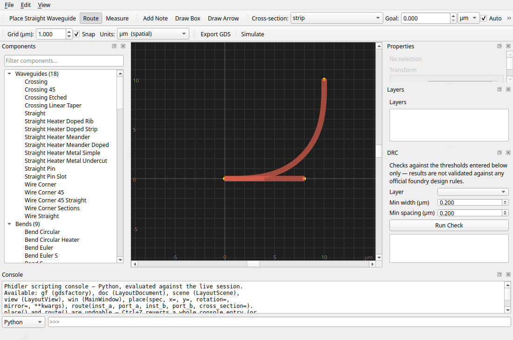

# User Guide

## Project Settings

On startup (and via File > New), Phidler shows a Project Settings dialog:

- **Platform**: pick Silicon (SOI), Silicon Nitride, Lithium Niobate (LN),
  Lithium Tantalate (LT), or Custom to set the core/cladding refractive
  indices and core thickness. LN/LT use real published thin-film-on-
  insulator index values (cross-checked against literature; see
  [Development](development.md#key-design-notes) for sourcing), not a
  full multi-layer stack-up model — there's no LN/LT-specific
  cross_section in the generic PDK either, so these presets affect the
  suggested-width estimate and project metadata, same as the other
  platforms, not the actual GDS layers.
- **Design wavelength**: used together with the platform to estimate a
  suggested single-mode waveguide width.
- **Cladding thickness**: a generic default (2µm), not tied to any
  specific foundry process or platform — switching platforms doesn't
  change this field, since it's a wafer/process choice rather than a
  material property. Doesn't affect the suggested-width estimate (which
  assumes a semi-infinite cladding) but is the real vertical extent used
  by FDTD Simulation's mode solver and propagation runs — see
  [FDTD simulation](#fdtd-simulation) for why this number actually
  matters there.
- **Default cross-section**: which gdsfactory cross-section new routes use
  by default.

The suggested width is an estimate from the effective-index method, not a
full 2D mode solve — read the note in the dialog before treating it as
exact. It's a starting point, not a substitute for your foundry's PDK
documentation.

You can reopen this dialog anytime via **File > Project Settings…**
without clearing your current design.

## Placing components

Use the **Components** panel on the left:

- Type in the filter box to search by name.
- Core photonics categories (waveguides, bends, couplers, MMIs, rings,
  MZIs, grating couplers, filters, spirals, tapers, edge couplers,
  detectors) are expanded by default. Everything else (MEMS, quantum,
  microfluidics, analog, test structures, etc.) is under **Other**.
- Hover over a component to preview its actual geometry before placing it.
- Click a component (or select it and press Enter) to arm placement, then
  click on the canvas to place it.

 

### Custom components

**File > Import Custom Components…** loads a Python file and adds any
`@gf.cell`-decorated functions it defines (with no required arguments) to
the palette under **Custom**. The file is remembered with the project, so
reopening a saved project that uses a custom part re-imports it
automatically.

## Editing on the canvas

- **Select**: click an item. Rubber-band drag to select multiple, or
  **Edit > Select All** (`Ctrl+A`).
- **Move**: drag a selected item. Dragging a port close to another
  instance's port snaps them into exact alignment; otherwise the move
  snaps to the grid. Snapping is applied live as you drag, not just on drop.
- **Rotate / Flip**: `R` rotates 90°; `H` and `V` flip the selection
  horizontally / vertically (about either screen axis). You can also use the
  on-canvas transform overlay (see below).
- **Delete / Copy / Paste**: `Delete`, `Ctrl+C`, `Ctrl+V`.
- **Cancel with `Esc`**: backs out of whatever you're in the middle of —
  an armed placement, the measure or source tool, or a route. `Esc` works no
  matter which panel has focus (you don't have to click the canvas first).
  Routing is two-stage: the first `Esc` drops a half-finished route (the start
  port you picked), and a second `Esc` exits routing mode.
- **Undo / Redo**: `Ctrl+Z` / `Ctrl+Shift+Z`.
- **Pan**: middle-mouse-drag. **Zoom**: scroll wheel, or View > Zoom to
  Fit / Zoom to Selection (`Ctrl+0` / `Ctrl+Shift+0`).
- **Right-click** the canvas for a context menu of common actions.
- Grid pitch and snap-to-grid are adjustable from the toolbar.

### Aligning and distributing multiple instances

Select 2 or more instances, then use **Edit > Align** (or the same submenu
in the right-click context menu):

- Align Left/Right/Top/Bottom Edges, or Align Horizontal/Vertical Centers.
- Distribute Horizontally/Vertically — needs 3+ instances; spaces their
  centers evenly along that axis, keeping the two extreme instances fixed.

Each is a single undo step, even when it moves several instances.

### Transform handles

Selecting a single instance shows a **rotate handle** above it on the canvas:

- **Drag the handle above the shape** to rotate freely around the instance's
  position. It previews live and commits to the undo stack on release.
- For a quick 90° rotation, a flip, or resetting rotation/mirror/scale back to
  defaults, use `R` / `H` / `V` or the right-click context menu.
- **Scale is not a drag gesture** — set it numerically in the Properties
  panel's **Scale** field (below), so a stray drag can't accidentally resize a
  component. Scale is a real geometric magnification of the shape and ports,
  not a component parameter like length.

## Editing parameters

Select an instance and use the **Properties** panel (right side) to edit
its parameters — length, width, radius, cross-section, etc. Click **Apply**
to regenerate its geometry. `cross_section` is a dropdown of the active
platform's valid names, so you can't type something invalid.

### Precision transform entry

The same panel has a **Transform** section above the parameter form —
X, Y, Rotation, Mirror, and Scale as typed numeric fields, for exact
placement instead of dragging by eye (matching a known coordinate from a
foundry PDK, for instance). Edit the values and click **Apply Transform**
to commit — it's undoable the same way a canvas drag is. The fields track
the selected instance's live transform automatically; editing one pauses
that tracking until you click elsewhere, so your typing isn't overwritten.

## Layers

The **Layers** panel (right side) lists every layer your design actually
uses — it starts empty and grows as you place/route/import. Toggle
visibility or change a layer's color with the checkbox and color swatch.

## Routing

1. Click **Route** in the toolbar (or press the shortcut shown in the
   tooltip).
2. Pick a cross-section from the toolbar dropdown.
3. Click a port on one component, then a port on another. A route is
   drawn between them — straight sections joined by euler bends
   (continuously-varying curvature, the standard low-loss "adiabatic"
   turn in photonics), not constant-radius circular bends.
4. Routes are selectable and deletable like any other item, and fully
   undoable.

**Diagonal** routing (on by default in the toolbar) sends a route along the
short diagonal path with all-angle euler bends, instead of a manhattan
L/U-turn. Untick it for manhattan-only routes. (Diagonal is ignored when a
length goal is set — those use the manhattan meander.)

**Component avoidance**: when a component sits on the straight path between the
two ports, the route automatically detours around it rather than crossing
through it. This is best-effort — a single detour around the obstacles in the
way; if it can't cleanly clear everything (several components boxing the route
in, or one right at a port), it falls back to a direct route rather than
weaving through. gdsfactory has no general obstacle router, so think of it as
"gets out of the way of the obvious blocker", not guaranteed avoidance on a
dense layout.

## Measuring distances

1. Click **Measure** in the toolbar.
2. Click a first point, then a second. A dashed line and label appear
   showing the distance, dx, and dy between them (also shown in the
   status bar) — clicking near a port snaps to its exact center, the
   same way routing's port clicks do.
3. Click again to start a new measurement (clears the old one), or press
   `Esc` to cancel a pending first point and exit Measure mode.

Turning on Measure mode turns off Route mode and cancels any armed
placement, and vice versa — only one click-driven mode is active at a
time.

## Reference GDS backdrop

**File > Import Reference GDS…** loads an existing layout (e.g. a foundry
floorplan) to design against. It's shown dimmed and is **not** included
in your own GDS export — it's purely a visual aid. **File > Clear
Reference** removes it. The reference path is remembered with the saved
project.

## Design rule checking (DRC)

The **DRC** panel (right side) runs a width/spacing check against
thresholds you enter yourself:

1. Pick a layer.
2. Enter a minimum width and/or minimum spacing in microns.
3. Click **Run Check**.
4. Double-click a violation in the results list to jump the canvas to it.

This checks against the numbers you typed in, not against any official
foundry rule deck — the generic PDK this app uses doesn't ship one.

## Saving, loading, and exporting

| Action | Menu | Produces |
|---|---|---|
| Save your editable project | File > Save / Save As | `.phidler` (JSON) |
| Reopen a project | File > Open | accepts `.phidler` or `.py` |
| Export final GDS | File > Export GDS | `.gds` |
| Export as Python code | File > Export Python Script… | `.py` |

**`.phidler`** is the full-fidelity project format — instances, routes,
layer colors, the reference backdrop path, and project settings all
round-trip exactly.

**Exported `.py` scripts** recreate your design with direct gdsfactory
calls (`gf.get_component(...)`, `add_ref`, `route_single`) — useful for
keeping a design as reviewable, version-controlled code. Running the
script directly (`python my_design.py`) writes a `.gds` named after the
script next to it.

**Opening a `.py` script** (File > Open) reads the actual code back into
Phidler — including hand-edits. If you change `length=10.0` to
`length=25.0` directly in the script and reopen it, Phidler picks up your
edit. This is additive to `.phidler`, not a replacement: layer colors and
the reference backdrop don't have a representation in the script format
and reset to defaults when you open one. Restructuring the generated code
(loops, helper functions, heavily renamed variables) isn't supported and
will raise a clear error rather than silently guessing wrong.

## Scripting console

The **Console** dock (bottom, toggle from the View menu) is a Python REPL
running against your live session:

Available names:

| Name | What it is |
|---|---|
| `gf` | the `gdsfactory` module |
| `doc` | the current `LayoutDocument` |
| `scene` | the current `LayoutScene` |
| `view` | the current `LayoutView` |
| `win` | the main window |
| `place(spec, x=, y=, rotation=, mirror=, **kwargs)` | places a component immediately |
| `route(inst_a, port_a, inst_b, port_b, cross_section=)` | routes between two ports immediately |

Multi-line blocks (`for`, `if`, `def`, ...) work like a normal REPL — keep
typing until you enter a blank line. Up/Down arrows recall history.

Everything the console does is real and immediate, but **bypasses the
undo stack** — it's a power-user tool for quick scripted edits, not a
replacement for the normal undo-tracked UI actions.

## FDTD simulation

The **Simulate** button in the toolbar opens a separate window that runs a
real local FDTD solve against your actual placed layout, using `photonfdtd` —
a separate, optional dependency not published on PyPI. If it's not
installed, you'll see a message explaining what to install instead of a
crash. The window has two tabs: a fast **Vertical Mode Profile** solver,
and full **Propagation (FDTD)** with movie playback.

### Checking your cladding is thick enough

Before running a full simulation, the **Vertical Mode Profile** tab is
worth a quick check — it solves the guided mode for your waveguide's
cross-section in well under a second:

1. Enter the **Core width**, **Wavelength**, and (optionally) more than
   one mode to solve for.
2. Click **Solve**. The plot shows the mode's intensity confined within
   the core (outlined in cyan over the field), decaying into the cladding
   above and below.
3. The status line reports the effective index and whether the mode is
   **well confined** or whether the **cladding may be too thin** — if
   your cladding (set in **File > Project Settings…**) isn't thick
   enough, the mode gets visibly squashed against the edge of the plot
   instead of decaying naturally. That's your answer to "is my cladding
   thickness enough" without needing a full propagation run.

### Placing sources and running a simulation

The **Propagation (FDTD)** tab runs a true 3D time-domain simulation and
plays the result back as a movie:

1. Click **Place Source on Canvas**, then click anywhere on the main
   canvas (clicking near a port snaps to its exact position, the same
   as the measure tool). Each click adds a row to the source table and a
   marker on the canvas.
2. Set the source's color either as **Wavelength (µm)** or **Energy
   (eV)** — editing either column updates the other automatically, so
   you can specify "a photon at 0.8 eV" directly instead of converting
   it to a wavelength by hand.
3. In the table, pick each source's **Kind**:
   - **dipole** — a plain oscillating point source. Always available,
     simplest option, not mode-matched to anything.
   - **single_photon** — launches a wavepacket built from the real
     guided mode at that position (needs **Core width** filled in),
     normalized to carry approximately one photon's worth of energy.
     **Photon count** scales the energy up from there.
   - **scripted** — type a Python expression of `t` (time, in seconds)
     into the **Script** column, e.g.
     `np.sin(2*np.pi*1.93e14*t) * np.exp(-((t-3e-15)/1e-15)**2)`
     (`np` is available). Evaluated with the same trust model as the
     scripting console elsewhere in this app — full Python, not a
     restricted sandbox, since this is already a single-user desktop
     tool. Wavelength/Energy/Photon count/Core width are ignored for
     this kind.
   - **cherenkov** — models a charged particle punching *up through the
     chip* (perpendicular to the layout plane, out of the top-down view)
     faster than light's local phase velocity. It is laid down as a track
     of point dipoles along the z axis, each fired with a delay equal to
     the particle's transit time to that point (distance / βc), whose
     superposition forms the Cherenkov shock cone — seen top-down as a
     ring spreading from the impact point. Set the particle speed
     **β = v/c** and the **tilt from vertical** in the source row
     (Cherenkov radiation requires β·n > 1, i.e. faster than the medium's
     phase velocity).
4. Set **Cell size** and **Run time**, then click **Run Simulation**. If
   the estimated run time is more than a few seconds, you'll be asked to
   confirm first — true 3D propagation is genuinely more expensive than
   a quick preview, and this estimate is calibrated against real
   measured runs, not guessed.
5. Once it finishes, use the **Play** button and the slider underneath
   to scrub through the field evolving over time, overlaid on a cyan
   outline of your actual chip layout — looping back to the start
   automatically.

#### Speed

Propagation runs use a few accelerators so they don't crawl:

- **Numba** (the **Acceleration** row) is on by default when installed. It
  JIT-compiles photonfdtd's field-update kernel — roughly 5× faster than the
  plain NumPy engine — and runs in the background, so the window stays
  responsive. The very first run compiles the kernel and is slower; that's
  cached to disk, so every run after is fast.
- **GPU** (CuPy) is far faster still but is left off by default: it runs on the
  main thread and briefly freezes the UI for the length of the run. Tick it when
  you want maximum speed and don't mind the pause.
- The propagation domain keeps only as much **cladding** as the mode's
  evanescent field actually needs (a few decay lengths, scaled by your
  platform's index contrast), rather than the full cladding the mode solver
  uses — that's a thinner z-stack and a much smaller, faster run, with no change
  to the top-down field you see. (Runs are also single-precision by default.)

**Read the disclaimer in the window.** Both tabs run a real solve against
your geometry, not a mockup — but treat the results as a qualitative
look at how light spreads through your structure, not a calibrated
transmission measurement or an actual quantum simulation, the same
spirit as the waveguide-width estimate in Project Settings. The mode
solver is scalar (no TE/TM distinction), and "photon count" scales
energy correctly *relative* to itself, but the absolute one-photon
baseline isn't exactly h·f — see the window's own disclaimer text for
specifics.

The material stack (core/cladding index, core thickness, **and now
cladding thickness**) comes from your current Project Settings platform
— switching between Silicon, SiN, LN, or LT there changes what gets
simulated here too.
