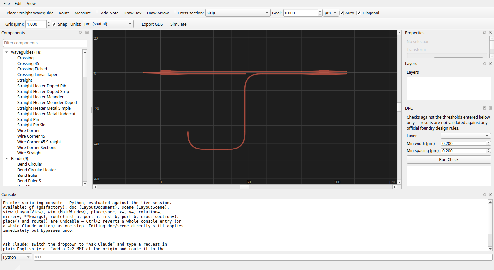

# Phidler

A graphical CAD application for photonic integrated circuit (PIC) layout,
built on [gdsfactory](https://gdsfactory.github.io/gdsfactory/) with a
desktop UI, and exportable GDS.



## Installation

Requires Python 3.10+.

### Linux

```sh
git clone https://github.com/ngpaladi/phidler.git
cd phidler
python3 -m venv .venv
source .venv/bin/activate
pip install -e ".[dev]"
```

### macOS

Requires Python 3.10+ from [python.org](https://www.python.org/downloads/)
or Homebrew (`brew install python@3.12`).

```sh
git clone https://github.com/ngpaladi/phidler.git
cd phidler
python3 -m venv .venv
source .venv/bin/activate
pip install -e ".[dev]"
```

### Windows

Requires Python 3.10+ from [python.org](https://www.python.org/downloads/).
Run in PowerShell or Command Prompt:

```
git clone https://github.com/ngpaladi/phidler.git
cd phidler
python -m venv .venv
.venv\Scripts\activate
pip install -e ".[dev]"
```

Add `docs` to the extras (`pip install -e ".[dev,docs]"`) to also build
this documentation site.

## Running it

**Linux / macOS:**

```sh
./run.sh
```

**Windows** — `run.sh` is bash-only; launch directly instead:

```
python -m phidler
```

Both show the Project Settings dialog first, where you pick a material
platform before placing components (see
[Project Settings](guide.md#project-settings)).

On Linux, if your system Qt6 conflicts with PySide6's bundled Qt6 (an
`undefined symbol` crash on import), `run.sh` already handles this — see
[Development: environment notes](development.md#environment-notes) for
details.

## Next steps

- [User Guide](guide.md) — how to place, edit, route, save, and export a
  design.
- [Development](development.md) — code layout, test suite, and what's
  verified vs. what still needs manual checking.
