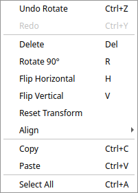
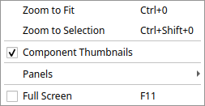

# Keyboard Shortcuts & Menus

A quick reference for keyboard shortcuts, mouse navigation, and what lives in
each menu.

> On **macOS**, use **⌘ (Command)** wherever this page says **Ctrl** — Qt maps
> the standard shortcuts (Save, Copy, Undo, …) to ⌘ automatically.

## Keyboard shortcuts

### File

| Action | Shortcut |
| --- | --- |
| New project | `Ctrl+N` |
| Open project | `Ctrl+O` |
| Save | `Ctrl+S` |
| Save As… | `Ctrl+Shift+S` |

### Edit

| Action | Shortcut |
| --- | --- |
| Undo | `Ctrl+Z` |
| Redo | `Ctrl+Shift+Z` |
| Copy | `Ctrl+C` |
| Paste | `Ctrl+V` |
| Select All | `Ctrl+A` |
| Delete selection | `Delete` |
| Rotate 90° | `R` |
| Flip horizontal | `H` |
| Flip vertical | `V` |

### View

| Action | Shortcut |
| --- | --- |
| Zoom to fit | `Ctrl+0` |
| Zoom to selection | `Ctrl+Shift+0` |
| Toggle fullscreen | `F11` |

### Tools

| Action | Shortcut |
| --- | --- |
| Cancel the current action (routing, placement, measure) | `Esc` |

`Esc` backs out one step at a time — it cancels a half-finished route first,
then exits routing mode on a second press.

## Mouse & canvas navigation

| Action | Gesture |
| --- | --- |
| Select | Left-click a component or route |
| Rubber-band select | Left-drag on empty canvas |
| Add to selection | `Shift`-click / `Ctrl`-click |
| Move | Left-drag a selected component |
| Pan | Middle-mouse drag |
| Zoom | Scroll wheel |
| Context menu | Right-click |
| Place (armed) | Left-click after picking a palette component |
| Route | Left-click a port, then another port |
| Measure | Left-click two points (snaps to nearby ports) |

Placement, dragging, and routing round to the grid pitch when **Snap** is on
(the toolbar checkbox); turn it off for free positioning.

## Menu reference

### File

New / open / save projects, import a [reference GDS](guide.md#reference-gds-backdrop)
backdrop or [custom components](guide.md#custom-components), and export a
[GDSII](guide.md#saving-loading-and-exporting) or a Python script.

### Edit

Undo/redo, the transform actions (rotate, flip, reset), delete, copy/paste,
select-all, and the [Align / Distribute](guide.md#editing-on-the-canvas)
submenu.

### View

Zoom to fit / selection, toggle the component-thumbnail previews, show or hide
individual panels, and enter fullscreen.

### Right-click (canvas)

The most-used editing actions on whatever is selected, without a trip to the
menu bar.

