# Feature Tour

A visual walk through what Phidler can do. If you'd rather build something
hands-on, jump to the [MZI Tutorial](tutorial.md); for the full reference, see
the [User Guide](guide.md).

## Open or start a project

Launching Phidler opens a recent-projects list — pick up where you left off,
browse for a file, or start fresh (which opens
[Project Settings](guide.md#project-settings) to choose a material platform).

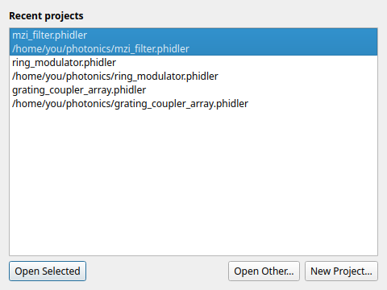

## The workspace

One window holds the whole flow: a searchable **component palette** on the left,
the **canvas** in the middle, and docked **Properties**, **Layers**, **DRC**, and
**Console** panels on the right and bottom. Toolbars across the top carry the
place / route / measure tools and the grid, snap, units, export, and simulate
controls.

## Place components

Every gdsfactory PDK component is in the palette, grouped by kind. Type in the
filter box to narrow hundreds of factories down to what you want, and hover any
entry for a live rendered preview before you place it.

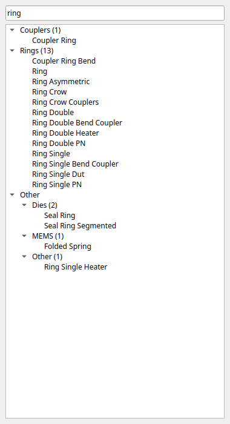 

The catalog is the whole gdsfactory generic PDK, grouped by kind — waveguides,
bends, couplers, splitters, rings, gratings, edge couplers, and more.

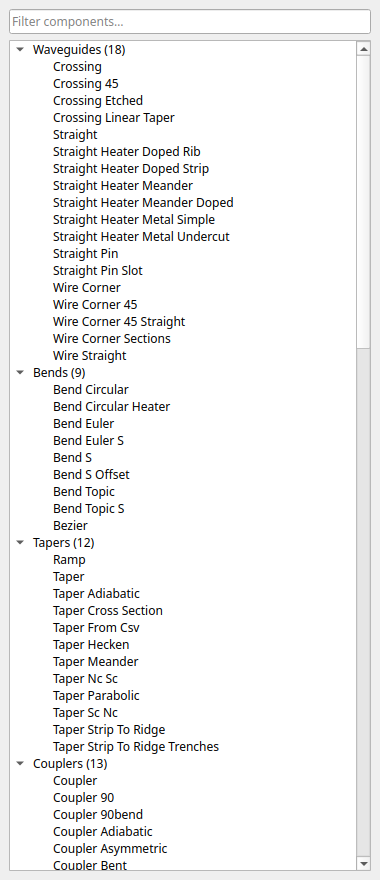

Selecting a placed component opens its full parameter set in the **Properties**
panel — position and orientation, an **Array** section for tiling, and every
gdsfactory factory argument (radius, gap, length, …), edited live.

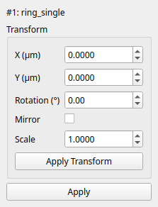

## Edit on the canvas

Drag to move; grab the on-canvas handles to rotate and scale; or type exact
values into Properties. A right-click gives you rotate, flip, align, copy,
delete, and zoom — all also on the **Edit** menu with keyboard shortcuts.

 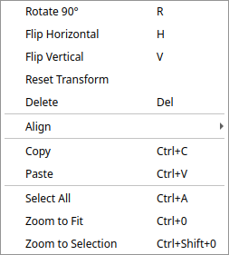

Select several components at once to move them as a group — or line them up and
space them evenly with the **Align** and **Distribute** tools.

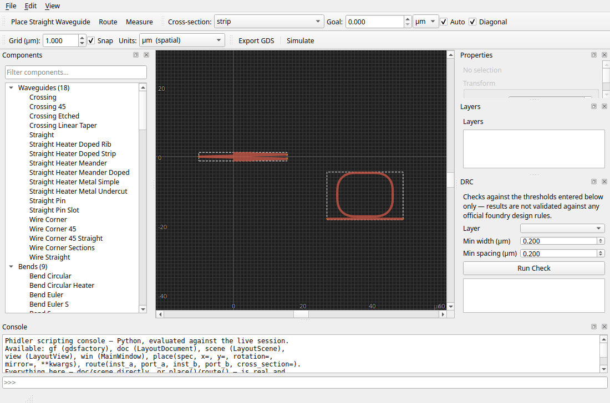

**Align** snaps a selection to a shared edge or centre:

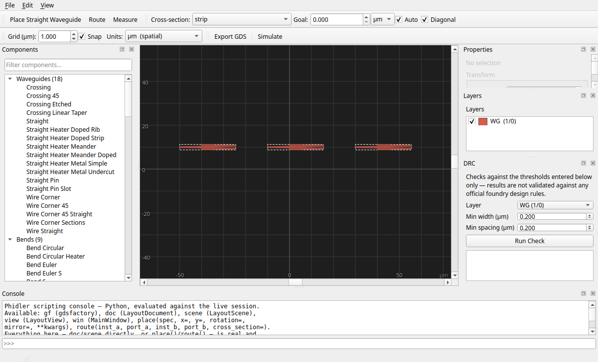

…and **Distribute** spaces three or more evenly:

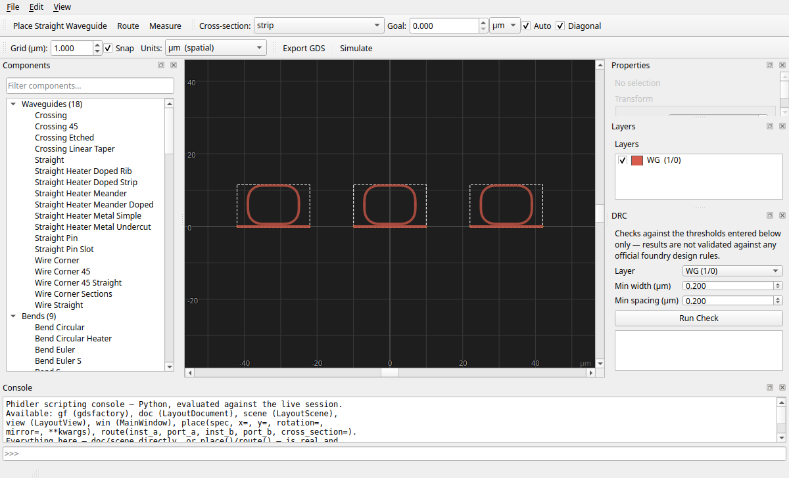

A background grid keeps things tidy — with **Snap** on, placement, dragging, and
routing all round to the grid pitch you set.

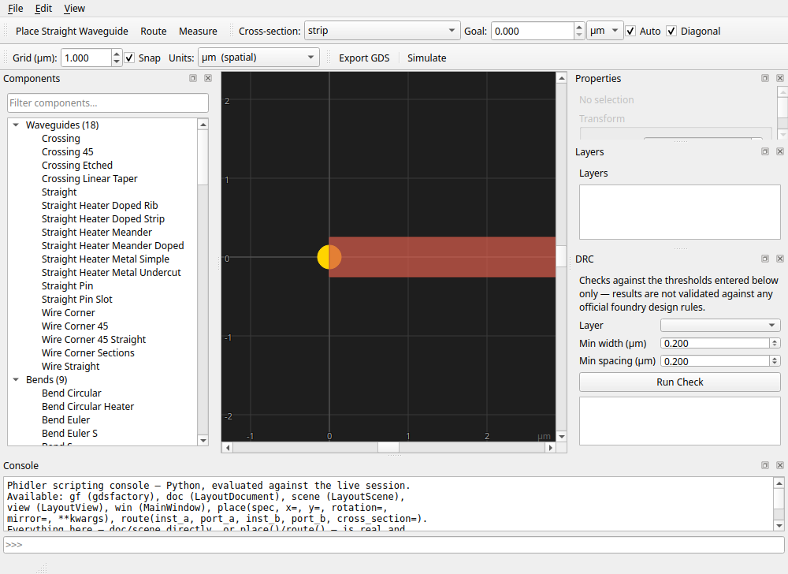

## Array a component

Need a fiber array, a bank of rings, or a splitter tree? Set columns, rows, and
pitch in the Array section and Phidler tiles the component as a single unit.

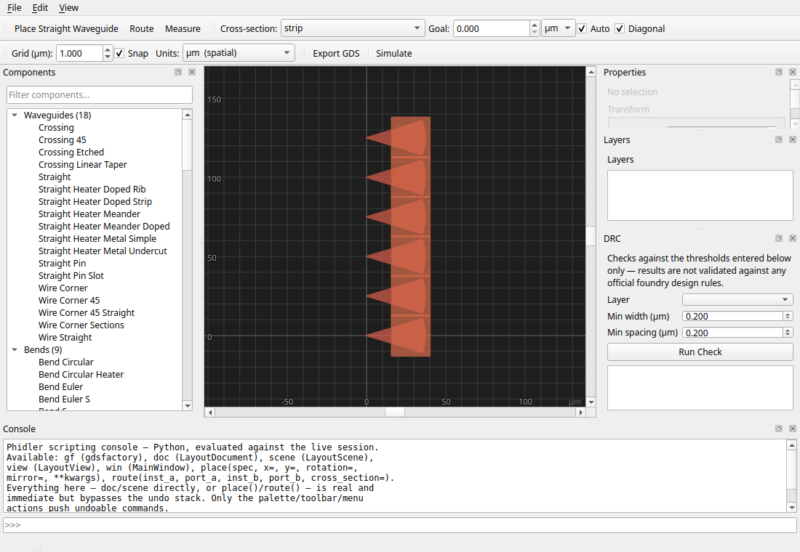

## Route between ports

Click a port, then another, and Phidler draws a waveguide between them. Pick the
**cross-section** the route is drawn with, route with all-angle diagonal bends or
Manhattan, and — the good part — set a **goal length** and let Phidler insert an
adiabatic meander to hit it, so matched delays come for free.

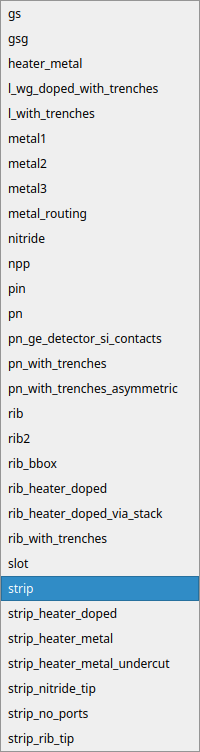

Select a route to read back its exact length and propagation time, including how
far it lands from your goal.

## Measure

The measure tool reports the distance between any two points — snapping to
nearby ports — with a dimension annotation right on the canvas.

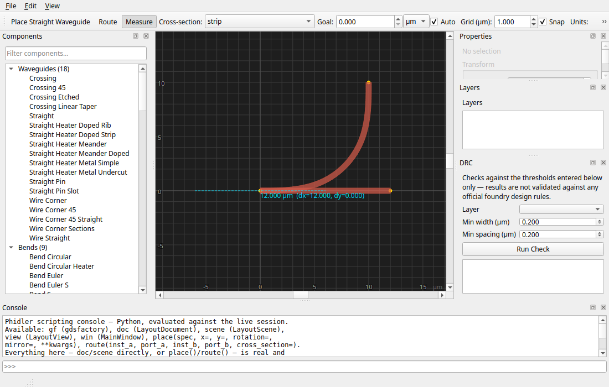

## Distance or delay

Switch the **Units** control from microns to propagation time and the rulers and
readouts re-express length as time-of-flight (fs / ns), using the effective
index from your last mode solve — the view that matters when you're budgeting
delays.

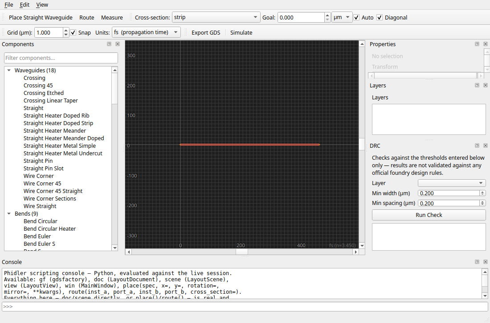

## Layers

The **Layers** panel lists every layer actually used by your design, with a
visibility toggle and an editable colour per layer.

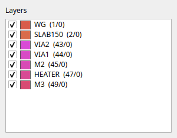

## Trace over a reference

Import an existing GDS as a dimmed, non-editable backdrop and lay your design
over it — handy for matching an existing chip or a supplied floorplan.

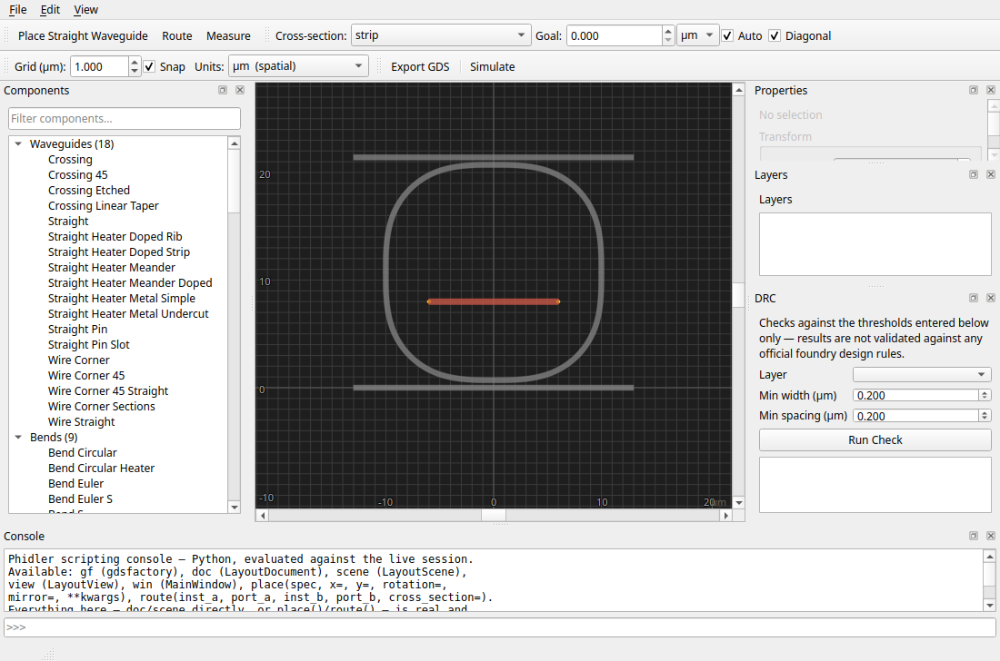

## Check design rules

A quick DRC checks minimum width and spacing on a chosen layer and lists the
violations; click one to zoom straight to it on the canvas.

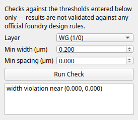 

## Simulate with FDTD

Phidler ships a real [FDTD engine](guide.md#fdtd-simulation). Start with the
**vertical mode profile** — solve the guided mode of your waveguide cross-section
and see its field and effective index.

Then place **sources** on the canvas — a plain dipole, a mode-matched single
photon, a scripted waveform, or a Cherenkov track — pick the cladding material,
choose CPU/Numba/GPU, and run.

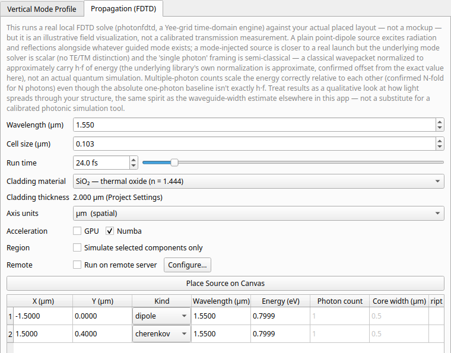 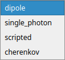 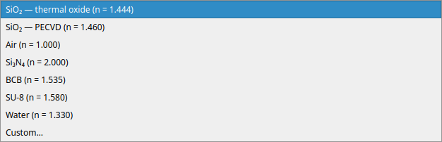

Watch the pulse propagate through your actual layout, scrub the field movie
frame by frame, and export it as an animated GIF.

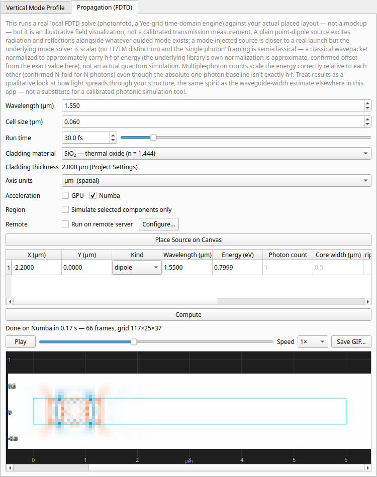

Runs too big for your laptop? Offload to a **GPU** (NVIDIA CUDA or AMD ROCm) or
to a **remote server** over SSH — the progress bar and results come back the same
either way.

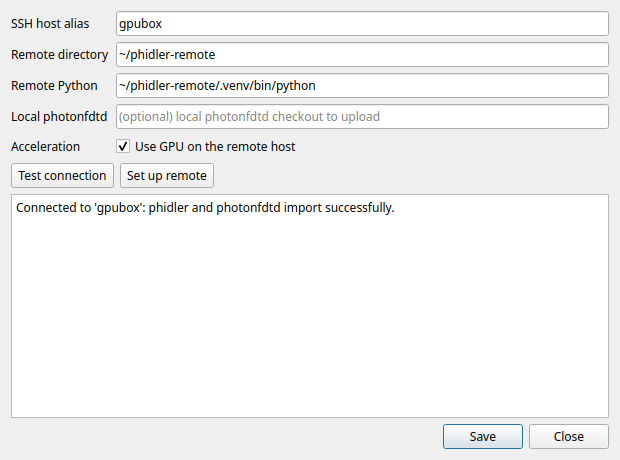

## Script it when you want to

For anything the UI doesn't cover, a **scripting console** runs Python against
the live session with `gf`, the document, and `place()`/`route()` helpers — mix
clicking and code freely.

## What you can build

From a single waveguide to a full circuit — splitters and combiners, ring
resonators and add–drop filters, fiber-coupler arrays, delay lines, and
interferometers — laid out visually and exported as GDS.

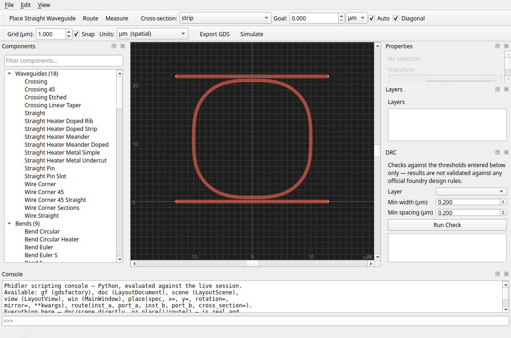

Active devices too — here a thermo-optic phase shifter, its metal heater and via
stack sitting over the optical waveguide (note the metal layers in the Layers
panel).

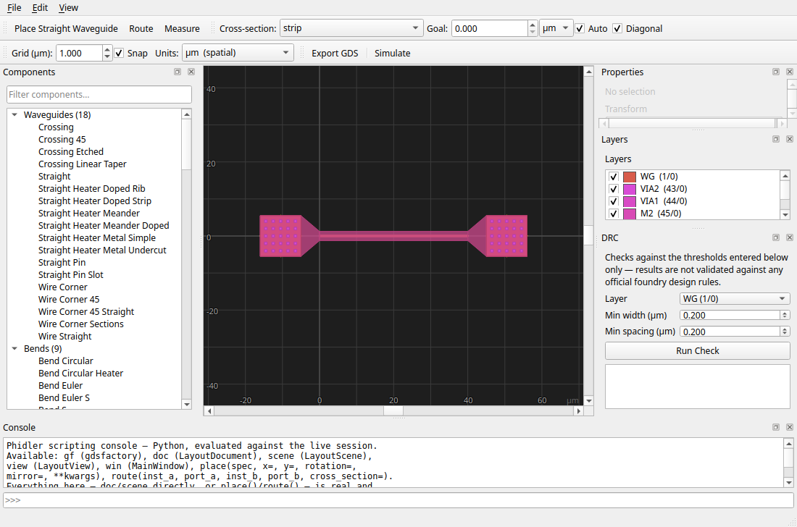

## Save & export

Projects save to an editable `.phidler` file that remembers your whole
design and simulation set-up. When you're done, export a foundry-ready
**GDSII**, or a Python script that rebuilds the layout in gdsfactory.

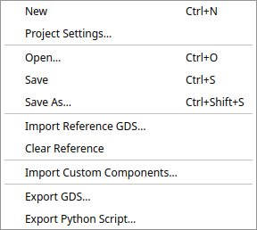

---

Ready to build one yourself? Start the [MZI Tutorial »](tutorial.md)
