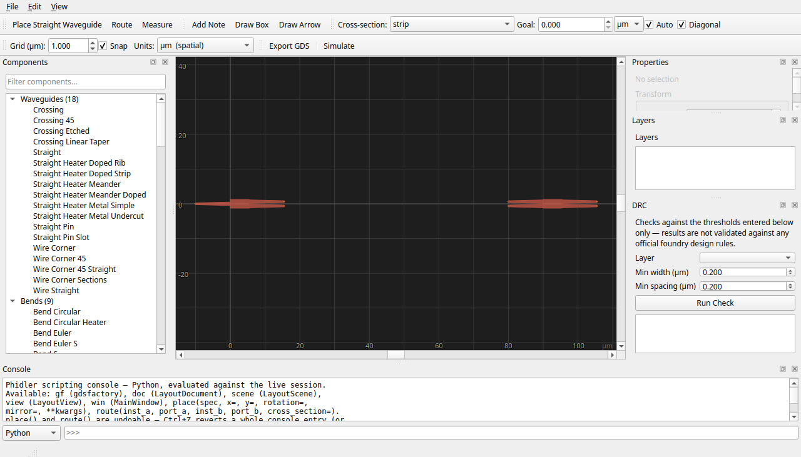
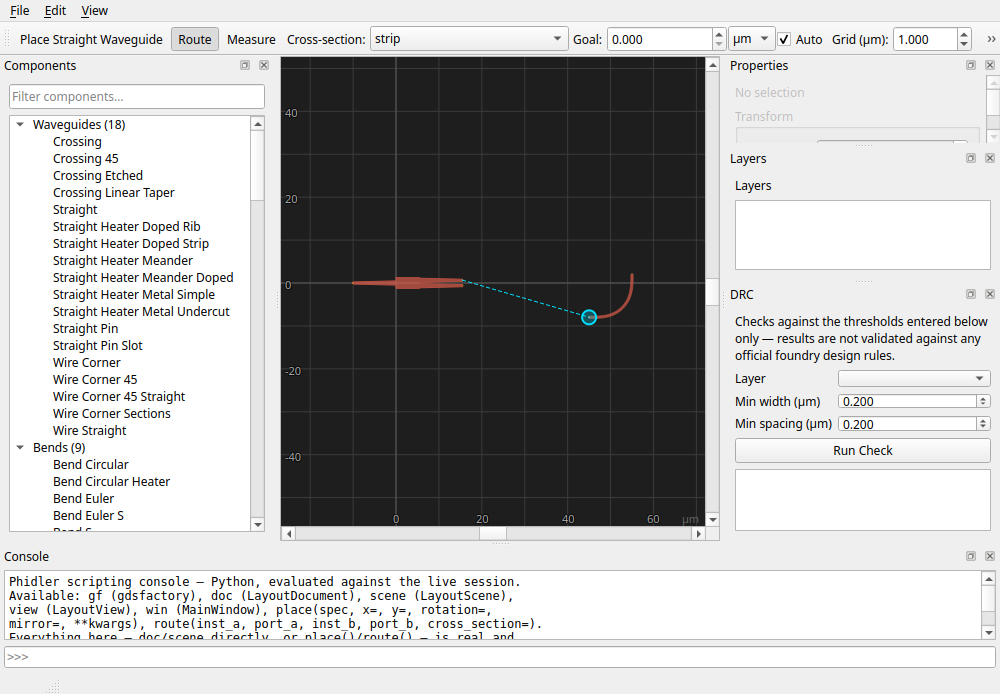
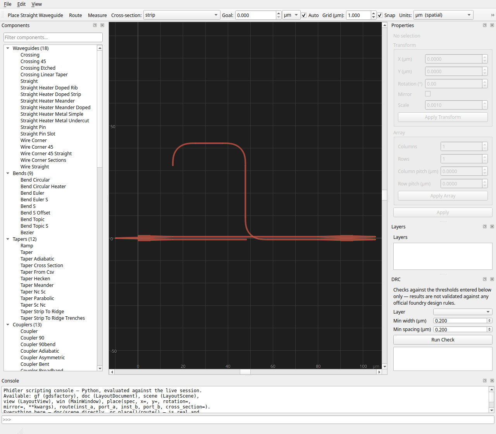
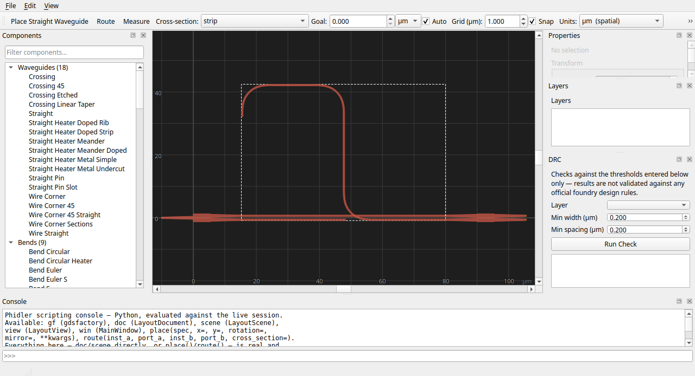
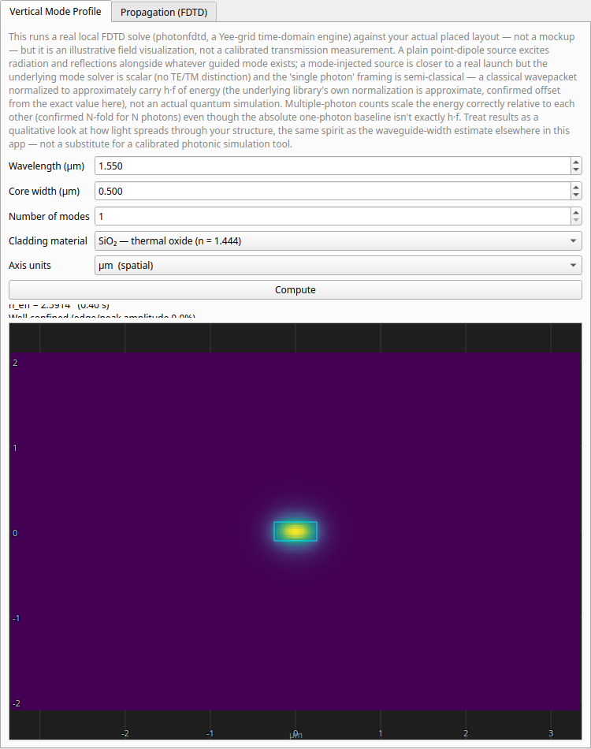
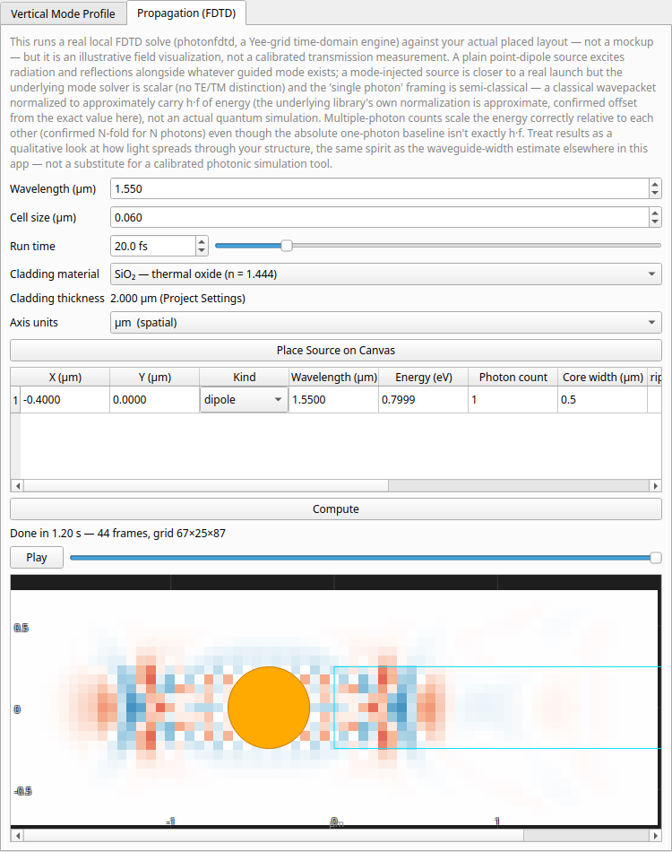

# Tutorial: Designing a Mach–Zehnder Interferometer

This is a hands-on walkthrough, written the way a photonic circuit designer
actually thinks while laying out a chip. We will design one of the most
important building blocks in integrated photonics — a **Mach–Zehnder
interferometer (MZI)** — from a blank canvas to an exported GDS, and along the
way touch nearly every feature of Phidler.

If you have never opened the app before, skim the [User Guide](guide.md) first
for the lay of the land; this page assumes you know where the panels are and
focuses on *designing something real*.

## What we are building, and why

A Mach–Zehnder interferometer splits light into two paths ("arms"), lets the
two halves travel different optical path lengths, and then recombines them. The
recombined intensity depends on the **phase difference** the two arms
accumulated, which in turn depends on wavelength. That makes the MZI the
workhorse behind:

- **Modulators** — put a phase shifter on one arm and you can switch light on
  and off.
- **Filters / (de)multiplexers** — an *imbalanced* MZI (one arm physically
  longer than the other) is wavelength-selective, with a periodic transfer
  function.
- **Sensors** — anything that changes the index in one arm shows up as a phase
  shift at the output.

We will build the imbalanced version, because the length difference is exactly
what Phidler's **goal-length routing** was made for.

A quick bit of physics so the numbers later mean something. The phase a guided
mode accumulates over a physical length `L` is

```
phase  =  (2π / λ) · n_eff · L
```

where `n_eff` is the waveguide's effective index. The two arms interfere
constructively or destructively depending on their phase difference,
`Δphase = (2π / λ) · n_eff · ΔL`, where `ΔL` is the **path-length imbalance**.
The output is periodic in optical frequency, and the period — the *free spectral
range* (FSR) — is set by that imbalance:

```
FSR  ≈  c / (n_g · ΔL)
```

(`n_g` is the group index). So the single most important number we will dial in
is `ΔL`, the extra length of one arm. Keep that in mind — it is the reason we
ask Phidler to route one arm to a specific target length.

## Step 1 — Start a project and pick a platform

When Phidler launches (or on **File → New**) it asks what material platform you
are designing for. This is not cosmetic: the core/cladding indices and the
design wavelength feed the suggested single-mode waveguide width, the
propagation-time readouts, and the FDTD simulator later.


For this tutorial pick **Silicon (SOI)** at **1550 nm** — the standard
telecom-band silicon photonics platform. Notice the dialog suggests a
single-mode width (around 450–500 nm is typical for 220 nm SOI strip; the tool's
effective-index estimate runs a little narrower and says so). Accept the
defaults and continue.

You are now looking at the main workspace: the **component palette** on the
left, the **canvas** in the middle, **Properties / Layers / DRC** docks on the
right, and a scripting **Console** along the bottom.


> **Tip:** Everything in the **View** menu is yours to rearrange. You can hide
> any dock, and toggle the inline **component thumbnails** in the palette if you
> prefer a denser text-only list.

## Step 2 — Place the splitter and the combiner

An MZI needs a 1×2 splitter at the input and a 2×2 (or 2×1) combiner at the
output. Silicon photonics almost always uses **multimode interference (MMI)**
couplers for this — they are compact, broadband, and fabrication-tolerant.

1. In the palette, open **Couplers → MMIs** (or just type `mmi` into the filter
   box at the top of the palette). Hovering a component shows a live preview of
   its geometry.
2. Click **`mmi1x2`** to arm it, then click on the canvas to drop it. This is
   our **splitter**: one input port (`o1`) on the left, two outputs (`o2`, `o3`)
   on the right.
3. Click **`mmi2x2`** and place it to the right of the splitter. This is our
   **combiner**: two inputs (`o1`, `o2`) on the left, two outputs (`o3`, `o4`)
   on the right. The second output is what makes the interference measurable —
   in a real chip you would send each output to a photodetector.

Select the combiner and use the **Properties** panel to set its exact position
(say X = 90 µm) so there is room for the arms to breathe. You can also drag it;
with snapping on, it will grid-align as you move — and the snap now happens
*live* while you drag, not just when you let go.



> **Orientation matters.** The combiner's input ports face *left* (west) and the
> splitter's outputs face *right* (east), so they naturally face each other. If
> you ever place a component the wrong way round, use **Edit → Flip Horizontal**
> (`H`) or **Flip Vertical** (`V`) to mirror it about either screen axis.

## Step 3 — Route the first (reference) arm

Now we connect ports with real waveguides. Click **Route** in the toolbar (or
press the routing toggle) to enter routing mode. The cursor becomes a crosshair.

As you move over the layout, Phidler **highlights the port you would snap to**
with a cyan ring — so you never have to pixel-hunt for a 0.5 µm-wide waveguide
tip. Click the splitter's top output (`o2`). A **rubber-band preview track** now
follows your cursor from that first port, and the next port you hover is
highlighted, so you can see exactly what you are about to connect before you
commit.



Click the combiner's top input (`o2`) to finish the route. Phidler runs a real
gdsfactory router and lays down a waveguide with **adiabatic Euler bends** (the
low-loss bend shape that gradually changes curvature rather than snapping to a
fixed radius). This is our **reference arm** — we let it take the shortest
natural path.

## Step 4 — Route the second arm to a target length (the delay)

Here is the heart of an *imbalanced* MZI. The lower arm needs to be **longer**
than the reference arm by a controlled amount, `ΔL`, to set the filter's
free spectral range.

Before drawing the second arm, set a length goal in the routing toolbar:

- Type a target into the **Goal** field — for this design, set **140 µm** (the
  natural path is only ~55 µm, so this asks for a healthy delay).
- Leave the unit as **µm**. You could instead choose **fs** or **ns** and
  specify the delay *in propagation time* — Phidler converts it to a length
  using the current effective index, because for a delay line what you usually
  care about is picoseconds, not microns.
- Make sure **Auto** is checked. In automatic mode, Phidler inserts an
  adiabatic meander and **binary-searches the meander size** until the routed
  length lands on your target (to within a fraction of a micron). With **Auto**
  off (manual mode) it routes directly and simply *reports* how far you are from
  the goal, leaving the adjusting to you.

Now route the splitter's lower output (`o3`) to the combiner's lower input
(`o1`). Watch the lower arm come in as a meander — that serpentine is the extra
optical path, built from the same low-loss Euler bends.



You have just built a complete, imbalanced Mach–Zehnder interferometer: one
straight reference arm, one length-matched delay arm, between an MMI splitter
and an MMI combiner.

## Step 5 — Read back length and propagation time

Select the delay arm (click it once, with routing mode off). The status bar
reports the route's **physical length**, the **propagation time** that length
implies at the current effective index, and — because we gave it a goal — the
**target and the delta** from it, plus whether the match was automatic or
manual.



This is where the design choices become physics. With `ΔL` now fixed by
the two arms' lengths, you can sanity-check your free spectral range against the
formula above. If the FSR is wrong, change the **Goal** and re-route the arm —
the meander resizes to match.

> **Switching the whole canvas to time units.** The toolbar **Units** selector
> flips every coordinate readout between spatial (µm / nm) and **propagation
> time (fs / ns)**. In time mode the rulers and cursor readout show how long
> light takes to traverse a distance, using the effective index from your last
> mode solve (or the core index if you have not run one). For delay-line work,
> designing directly in femtoseconds is often more natural than in microns.

## Step 6 — Check the guided mode and simulate

Before trusting any layout, a photonic designer confirms the waveguide actually
guides a single, well-confined mode. Open the **FDTD simulation** window from the
**Simulate** button in the toolbar.

The **Vertical Mode Profile** tab solves the waveguide cross-section and shows
the mode and its effective index. The **core is outlined in cyan** over the
field, so you can see at a glance how the mode sits relative to the waveguide.
A well-confined mode sits comfortably inside that outline; if the cladding is
too thin the solver warns that the mode is truncating against the domain edge.
(If you want to model an unbounded stack, the Project Settings "assume infinite
cladding depth" option sizes the cladding generously so confinement is never
artificially limited.)



The **Propagation** tab runs a true 3-D FDTD time-domain simulation: place a
source, hit Compute, and watch the field animate down the guide. Here too the
**circuit elements are outlined in cyan** on top of the field, so you can read
where light is relative to your structures rather than guessing.



You choose the excitation per source in the source table's **Kind** column:

- **dipole** — a plain oscillating point source; always available.
- **single photon** — launches the locally-solved guided mode (a mode-matched
  source).
- **scripted** — drives the source with your own Python waveform expression.
- **cherenkov** — models a charged particle crossing the domain faster than
  light's local phase velocity, laid down as a track of time-staggered dipoles
  (transit time = distance / βc). Their superposition forms the Cherenkov shock
  cone — set the particle speed (β = v/c), track direction, and track length in
  the source row.

> The effective index your mode solve produces is fed back into the propagation
> **time** readouts and rulers, so after solving, the femtosecond numbers on
> your delay arm reflect the *real* mode, not just the bulk material index.

## Step 7 — Run a quick design-rule check

Foundries impose minimum widths and spacings. Open the **DRC** panel, enter the
thresholds for your process, and run the check. Violations are highlighted on
the canvas in red, and double-clicking one jumps the view straight to it.


For our MZI the thing to watch is the meander: tight delay lines can pull
waveguides close enough to **couple** unintentionally. If the DRC flags a
spacing violation in the serpentine, give the arm a larger goal length (more
room to spread out) or move the components farther apart and re-route.

## Step 8 — Export

When the layout passes, export it:

- **File → Export GDS…** writes the flattened mask layout you would hand to a
  foundry. Routes, components, and arrays all come through as real geometry.
- **File → Export Python Script…** writes a standalone gdsfactory script that
  recreates the design as reviewable, version-controllable code.
- **File → Save** keeps the editable `.phidler` project, which remembers
  everything — including each route's length goal, so reopening reproduces the
  exact same meander.

## Where to go next

You now have the full loop: place, route, length-match, verify, and export. A
few natural extensions of this same MZI:

- **Make it a modulator** by leaving room on one arm for a phase shifter, and
  arraying contact pads with the **Array** options in the Properties panel
  (columns / rows / pitch) instead of hunting for a pre-made pad-array part.
- **Build a filter bank** by duplicating the MZI with different delay lengths —
  each goal length you type sets a different free spectral range.
- **Tune for fabrication** by sweeping the waveguide width in Properties and
  re-checking the mode profile.

For the full reference on every panel and tool, see the [User Guide](guide.md).
For how the app is built and tested, see [Development](development.md).
